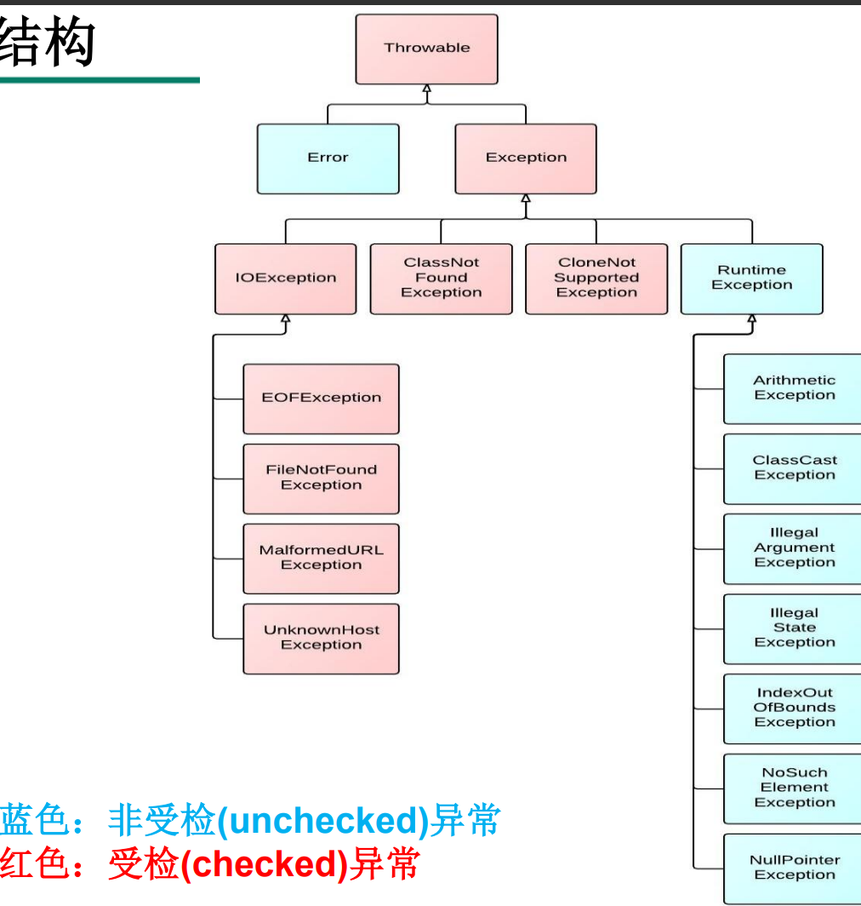

## 1. JAVA基础

### 1.1 保留字(reserved word) 

Java保留字：现有Java版本尚未使用，但以后版本可能会作为关键字使用。自己命名标识符时要避免使用这些保留字 goto 、const

### 1.2 数据类型

| 数据类型 | 关键字       | 内存占用 | 取值范围                                                     |
| :------- | ------------ | -------- | :----------------------------------------------------------- |
| 整数类型 | byte         | 1        | -128~127                                                     |
|          | short        | 2        | -32768~32767                                                 |
|          | int(默认)    | 4        | -2的31次方到2的31次方-1                                      |
|          | long         | 8        | -2的63次方到2的63次方-1                                      |
| 浮点类型 | float        | 4        | 负数：-3.402823E+38到-1.401298E-45 正数： 1.401298E-45到3.402823E+38 |
|          | double(默认) | 8        | 负数：-1.797693E+308到-4.9000000E-324 正数：4.9000000E-324 到1.797693E+308 |
| 字符类型 | char         | 2        | 0-65535                                                      |
| 布尔类型 | boolean      | 1        | true，false                                                  |

**说明：**

 e+38表示是乘以10的38次方，同样，e-45表示乘以10的负45次方。

 在java中整数默认是int类型，浮点数默认是double类型。

1. 变量在使用之前，**必须初始化**（赋值）。
2. 定义long类型的变量时，需要在整数的后面加L（大小写均可，建议大写）。因为整数默认是int类型，整数太大可能超出int范围。
3. 定义float类型的变量时，需要在小数的后面加F（大小写均可，建议大写）。因为浮点数的默认类型是double， double的取值范围是大于float的，类型不兼容。
4. boolean类型不能与其他基本数据类型相互转换。
5. 当把任何基本数据类型的值和字符串(String)进行连接运算时(+)，基本数据类型的值将自动转化为字符串(String)类型。
6. 高转低没有强制转换的话会报错
7. 整数位是零时可以省略0

````java
float b = .32f;
````


### 1.3 UTF-8（了解）

UTF-8 是在互联网上使用最广的一种 Unicode 的实现方式。

> UTF-8 是一种变长的编码方式。它可以使用 1-6 个字节表示一个符号，根据 不同的符号而变化字节长度。 

**UTF-8的编码规则：** 

- 对于单字节的UTF-8编码，该字节的最高位为0，其余7位用来对字符进行编码（等同于 ASCII码）。

- 对于多字节的UTF-8编码，如果编码包含 n 个字节，那么第一个字节的前 n 位为1，第一个字节的第 n+1 位为0，该字节的剩余各位用来对字符进行编码。在第一个字节之后的 所有的字节，都是最高两位为"10"，其余6位用来对字符进行编码。


Unicode 字符集只是定义了字符的集合和唯一编号，Unicode 编码， 则是对 UTF-8、UCS-2/UTF-16 等具体编码方案的统称而已，并不是具体的编码方案。所以当需要用到字符编码的时候，你可以写 gb2312，codepage936，utf-8，utf-16，但请不要写 Unicode。 造成乱码的原因就是因为使用了错误的字符编码去解码字节流，因此当我们在思考任何跟文本 显示有关的问题时，请时刻保持清醒：当前使用的字符编码是什么。只有这样，我们才能正确 分析和处理乱码问题。 常见 CharSet 有：**GBK、GB2312、US-ASCII、ISO-8859-1、UTF-8、UTF-16BE、UTF-16LE、UTF-16**

### 1.4 计算机数字编码

- Java整数常量默认是int类型，当用二进制定义整数时，其第32位是符号位； 当是long类型时，二进制默认占64位，第64位是符号位


二进制的整数有如下三种形式： 

- 原码：直接将一个数值换成二进制数。最高位是符号位 


- 负数的反码：是对原码按位取反，只是最高位（符号位）确定为1。


- 负数的补码：其反码加1。


计算机以二进制补码的形式保存所有的整数。 

- 正数的原码、反码、补码都相同 


- 负数的补码是其反码+1


**为什么要使用原码、反码、补码表示形式呢？**

计算机辨别“符号位”显然会让计算机的基础电路设计变得十分复杂! 于是 人们想出了将符号位也参与运算的方法. 我们知道, 根据运算法则减去一个正数等于加上一个负数, 即: 1-1 = 1 + (-1) = 0 , 所以机器可以**只有加法而没有减法**, 这样计算机运算的设计就更简单了。


### 1.5 运算符

思考: 区别

```java
short s = 3;
s = s + 2;//报错，提示需要int类型
s += 2; //啊对对对
```

| 位运算符细节 |                                                              |
| :----------: | ------------------------------------------------------------ |
|      <<      | 空位补0，被移除的位丢弃，空缺位补0。                         |
|      >>      | 被移位的二进制最高位是0，右移后，空缺位补0；最高位是1，空缺位补1 |
|     >>>      | 被移位二进制最高位无论是0或者是1，**空缺位都用0补**。        |


### 1.6 循环和判断

**switch语句有关规则** 

- switch(表达式)中表达式的值必须是下述几种类型之一：**char, byte, short, int, Character, Byte, Short, Integer, String, or an enum**
- case子句中的值必须是常量，不能是变量名或不确定的表达式值；


````java
int i = 0;
switch (0.34) {//报错
    case i + 21://报错
        break;
}
````


### 1.7 数组

- 动态初始化：数组声明且为数组元素分配空间与赋值的操作分开进行
- 静态初始化：在定义数组的同时就为数组元素分配空间并赋值
- 数组一经分配空间，其中的每个元素也被按照成员变量同样的方式被隐式初始化

特殊格式：

````java
int[] arr = {元素1,元素2,...};//简化版格式
````

````java
int[][] arr = new int[3][]; //二维数组中有3个一维数组。 每个一维数组都是默认初始化值null
````

````java
int[][]arr = new int[][3]; //非法
````

> 注意特殊写法情况：int[] x,y[]; x是一维数组，y是二维数组。


#### 1.7.1 java中的内存分配

|  区域名称  | 作用                                                         |
| :--------: | ------------------------------------------------------------ |
|   寄存器   | 给CPU使用，和我们开发无关。                                  |
| 本地方法栈 | JVM在使用操作系统功能的时候使用，和我们开发无关。            |
|   方法区   | 用于存储已被虚拟机加载的**类信息、常量、静态变量**、即时编译器编译后的代码等数据 |
|   堆内存   | 存储对象或者数组，new来创建的，都存储在堆内存。              |
|     栈     | 是指虚拟机栈。虚拟机栈用于存储局部变量等。 局部变量表存放了编译期可知长度的各种基本数据类型、对象引用。 方法执行完自动释放。 |

打印数组的时候，实际出现的是数组的**地址值**。

数组的地址值：就表示数组在内存中的位置。

以[I@6d03e736为例：

[ ：表示现在打印的是一个数组。

I：表示现在打印的数组是int类型的。

@：仅仅是一个间隔符号而已。

6d03e736：就是数组在内存中真正的地址值。（十六进制的）


#### 1.7.2 Arrays工具类的使用

**1）int binarySearch(type[] a, type key)**

使用二分法查询 key 元素值在 a 数组中出现的索引，如果 a 数组不包含 key 元素值，则返回**负数**。调用该方法时要求数组中元素己经按升序排列

**2）int binarySearch(type[] a, int fromIndex, int toIndex, type key)**

只搜索 a 数组中 fromIndex 到 toIndex 索引的元素。调用该方法时要求数组中元素己经按升序排列

**3）type[] copyOf(type[] original, int length)**

把 original 数组复制成一个新数组，length 是新数组的长度。如果 length 小于 original 数组的长度，则新数组就是原数组的前面 length 个元素，如果 length 大于 original 数组的长度，则新数组的前面元索就是原数组的所有元素，后面补充 0（数值类型）、false（布尔类型）或者 null（引用类型）。

> 此函数源码
>
> ````java
> public static int[] copyOf(int[] original, int newLength) {
>         int[] copy = new int[newLength];
>         System.arraycopy(original, 0, copy, 0, Math.min(original.length, newLength));
>         return copy;
>     }
> ````
>
> 关于 public static void arraycopy(Object src,int srcPos,Object dest,int destPos,int length)
>
> 该方法的作用是数组复制，即从指定源数组中复制一个数组，复制从指定的位置开始，到目标数组的指定位置结束。
>
> 其中，src 表示源数组，srcPos 表示从源数组中复制的起始位置，dest 表示目标数组，destPos 表示要复制到的目标数组的起始位置，length 表示复制的个数。
>
> - 对于一维数组来说，这种复制属性值传递，**修改副本不会影响原来的值**。
>
> - 对于二维或者一维数组中存放的是对象时，复制结果是：**一维的引用变量传递给副本的一维数组**。**修改副本时，会影响原来的数组**。
>
>   简而言之，就是**浅拷贝**
>
> ````java
> public class System_arrayCopy {
>     public static void main(String[] args) {
>         char[] srcArray = {'A','B','C','D'};
>         char[] destArray = {'E','F','G','H'};
>         System.arraycopy(srcArray,1,destArray,1,2);
>         System.out.println("源数组：");
>         for(int i = 0;i < srcArray.length;i++) {
>             System.out.println(srcArray[i]);//ABCD
>         }
>         System.out.println("目标数组：");
>         for(int j = 0;j < destArray.length;j++) {
>             System.out.println(destArray[j]);//EBCH
>         }
>     }
> }
> ````

**4）type[] copyOfRange(type[] original, int from, int to)**

只复制 original 数组的 from 索引到 to 索引的元素。

**5）boolean equals(type[] a, type[] a2)**

如果 a 数组和 a2 数组的长度相等，而且 a 数组和 a2 数组的数组元素也一一相同，该方法将返回 true。底层调用对象的equals()方法

**6）void fill(type[] a, type val)**

该方法将会把 a 数组的所有元素都赋值为 val。

**7）void fill(type[] a, int fromIndex, int toIndex, type val)**

仅将 a 数组的 fromIndex 到 toIndex 索引的数组元素赋值为 val。

**8）void sort(type[] a)**

该方法对 a 数组的数组元素进行排序。

**9）void sort(type[] a, int fromIndex, int toIndex)**

仅对 fromIndex 到 toIndex 索引的元素进行排序。

**10）String toString(type[] a)**

该方法将一个数组转换成一个字符串

**11）int compare(type[] a, type[] b)**

比较数组值大小，先找出第一个不一样的值比较大小，找不出就返回 a.length - b.length

两者为null返回0，a为null且b为非null返回-1，b为null且a为非null返回1

**12）\<T> int compare(T[] a, T[] b, Comparator<? super T> cmp)**

指定比较器作为比较依据

**13）int hashCode(type[] a)**

返回数组对应哈希值


## 2. 面向对象

### 2.1 面向过程(POP) 与 面向对象(OOP)

-  二者都是一种思想，面向对象是相对于面向过程而言的。面向过程强调的是功能行为，以函数为最小单位，考虑怎么做。面向对象，将功能封装进对象，强调具备了功能的对象，以类/对象为最小单位，考虑谁来做。

-  面向对象更加强调运用人类在日常的思维逻辑中采用的思想方法与原则，如 抽象、分类、继承、聚合、多态等。


### 2.2 构造器的特征 

- 它具有与类相同的名称 

- 它不声明返回值类型。（与声明为void不同） 

- 不能被static、final、synchronized、abstract、native修饰，不能有 return语句返回值


### 2.3 关键字--this

- 使用this访问属性和方法时， 如果在**本类中未找到**，会从**父类中查找**
- 可以在类的构造器中使用"this(形参列表)"的方式，调用本类中重载的其他的构造器！ 
- 明确：构造器中不能通过"this(形参列表)"的方式**调用自身**构造器
- 如果一个类中声明了n个构造器，则最多有 **n - 1个**构造器中使用了 "this(形参列表)"
- "this(形参列表)"必须声明在类的构造器的**首行**！
- 在类的一个构造器中，最多只能声明**一个**"this(形参列表)"


### 2.5 包管理

- 可以使用java.util.*的方式，一次性导入util包下所有的类或接口。

> 上述方式不包含该包下的子包

- import static组合的使用：调用指定类或接口下的静态的属性或方法

````java
import static java.lang.Math.min;
int i = min(23,32);
````


### 2.6 访问权限控制符

|     访问范围     | private  | friendly(默认) | protected | public |
| :--------------: | :------: | :------------: | :-------: | :----: |
|     同一个类     |  可访问  |     可访问     |  可访问   | 可访问 |
| 同一包中的其他类 | 不可访问 |     可访问     |  可访问   | 可访问 |
|  不同包中的子类  | 不可访问 |    不可访问    |  可访问   | 可访问 |
| 不同包中的非子类 | 不可访问 |    不可访问    | 不可访问  | 可访问 |


### 2.7 继承

#### 2.7.1 方法重写

- 子类重写的方法的返回值类型不能大于父类被重写的方法的返回值类型，也就是说子类返回值可以是子类

  ````java
  class A{}
  class B extends A {}
  
  class C {
      public A test() {
          return null;
      }
  }
  
  class D extends C {
      @Override
      public B test() { //正确
          return null;
      }
  }
  ````

  

- 子类重写的方法使用的访问权限不能小于父类被重写的方法的访问权限，就是说子类应该更开放

  ````java
  class D extends C {
      @Override
      private B test() { //错
          return null;
      }
  }
  ````

- 子类不能**重写父类中声明为private权限**的方法 

- 子类方法抛出的异常不能大于父类被重写方法的异常，比如说父类掏Exception，子类不能掏Throwable，只能掏**更有指向性的异常**

- 子类与父类中同名同参数的方法必须**同时声明**为非static的(即为重写)，或者同时声明为 static的（不是重写）。因为static方法是属于类的，子类无法覆盖父类的方法。

  

#### 2.7.2 父类构造

- 子类中所有的构造器**默认都会访问父类中空参数的构造器**
- 当父类中没有空参数的构造器时，子类的构造器必须通过this(参数列表)或者super(参数列表)语句指定调用本类或者父类中相应的 构造器。同时，只能”二选一” ，且必须放在构造器的**首行**
- 如果子类构造器中既未显式调用父类或本类的构造器，且父类中又没有无参的构造器，则**编译出错**


#### 2.7.3 方法的重载与重写 

从编译和运行的角度看：

重载，是指允许存在多个同名方法，而这些方法的参数不同。编译器根据方法不同的参数表，对同名方法的名称做修饰。对于编译器而言，这些同名方法就成了不同的方法。它们的调用地址在编译期就绑定了。Java的重载是可以包括父类 和子类的，即子类可以重载父类的同名不同参数的方法。 所以：对于重载而言，在方法调用之前，编译器就已经确定了所要调用的方法， 这称为“早绑定”或“静态绑定”； 

对于多态，只有等到方法调用的那一刻，解释运行器才会确定所要调用的具体方法，这称为“晚绑定”或“动态绑定”。

**引用一句Bruce Eckel的话：“不要犯傻，如果它不是晚绑定，它就不是多态。”**

### 2.8 多态

#### 2.8.1 instanceof 操作符

x instanceof A：检验x是否为类A的对象，返回值为boolean型。

- 要求x所属的类与类A必须是子类和父类的关系，否则编译错误。
- **父 instanceof 子** 为false
- **子 instanceof 父** 为true

#### 2.8.2 向下转型

对Java对象的强制类型转换称为造型 

- 从子类到父类的类型转换可以自动进行 
- 从父类到子类的类型转换必须通过造型(强制类型转换)实现
- 无继承关系的引用类型间的转换是非法的
- 在造型前可以使用instanceof操作符测试一个对象的类型


#### 2.8.3 重写equals()方法的原则

- 对称性：如果x.equals(y)返回是“true” ，那么y.equals(x)也应该返回是 “true”。
- 自反性：x.equals(x)必须返回是“true”。 
- 传递性：如果x.equals(y)返回是“true” ，而且y.equals(z)返回是“true” ， 那么z.equals(x)也应该返回是“true”。
- 一致性：如果x.equals(y)返回是“true” ，只要x和y内容一直不变，不管你 重复x.equals(y)多少次，返回都是“true”。
- 任何情况下，x.equals(null)，永远返回是“false” ； x.equals(和x不同类型的对象)永远返回是“false”。


### 2.9 理解main()方法的语法

- 由于Java虚拟机需要调用类的main()方法，所以该方法的访问权限必须是 public，又因为Java虚拟机在执行main()方法时不必创建对象，所以该方法必须 是static的，该方法接收一个String类型的数组参数，该数组中保存执行Java命令 时传递给所运行的类的参数。

#### 2.9.1 命令行参数用法举例

````java
public class CommandPara {
    public static void main(String[] args) {
        for (int i = 0; i < args.length; i++) {
        	System.out.println("args[" + i + "] = " + args[i]);
        }
    }
}
````

````shell
java CommandPara "Tom" "Jerry" "Shkstart"
````

面试题

此处，Something类的文件名叫OtherThing.java

```java
class Som {
    public static void main(String[] something_to_do) {
        System.out.println("Do something ...");
    }
}
```

上述程序是否可以正常编译、运行？ **可以**


### 2.10 代码块

**静态代码块：用static 修饰的代码块**

1. 可以对类的属性、类的声明进行初始化操作。
2. 不可以调用非静态的属性和方法。  
3. 若有多个静态的代码块，那么按照**从上到下**的顺序依次执行。
4. 静态代码块的执行要先于非静态代码块。
5. 静态代码块随着类的加载而加载，且只执行一次。

**非静态代码块：没有static修饰的代码块**

1. 可以对类的属性、类的声明进行初始化操作。
2. 除了调用非静态的结构外，还可以**调用静态的变量或方法**
3.  若有多个非静态的代码块，那么按照从**上到下**的顺序依次执行。
4. 每次创建对象的时候，都会执行一次。且**先于构造器执行**。


### 2.11 抽象类

- 不能用abstract修饰变量、代码块、构造器；

-  不能用abstract修饰私有方法、静态方法、final的方法、final的类。

抽象类是用来模型化那些父类无法确定全部实现，而是由其子类提供具体实现的对象的类。


#### 2.11.1 模板方法设计模式(TemplateMethod)

抽象类体现的就是一种模板模式的设计，抽象类作为多个子类的通用模板，子类在抽象类的基础上进行扩展、改造，但子类总体上会保留抽象类的行为方式。

解决的问题： 

- 当功能内部一部分实现是确定的，一部分实现是不确定的。这时可以 把不确定的部分暴露出去，让子类去实现。
- 换句话说，在软件开发中实现一个算法时，整体步骤很固定、通用， 这些步骤已经在父类中写好了。但是某些部分易变，易变部分可以抽象出来，供不同子类实现。这就是一种模板模式。

````java
abstract class Template {
    public final void getTime() {
        long start = System.currentTimeMillis();
        code();
        long end = System.currentTimeMillis();
        System.out.println("执行时间是：" + (end - start));
    }
    public abstract void code();
}
class SubTemplate extends Template {
    public void code() {
        for (int i = 0; i < 10000; i++) {
            System.out.println(i);
        }
    }
}
````


### 2.12 接口 

**接口(interface)是抽象方法和常量值定义的集合。**

**接口的特点：**

1. 用interface来定义。

2. 接口中的所有成员变量都默认是由**public static final**修饰的，**写其他的会报错！**

3. 接口中的所有**抽象**方法都默认是由**public abstract**修饰的

4. 接口中**没有构造器**。

5. 接口采用**多继承**机制。

6. **实现类必须实现接口，不管其父类有没有相同方法**

   ````java
   interface A {
       void test();
   }
   class B {
       void test() {}
   }
   class C extends B implements A {} //报错，必须实现方法
   ````

**定义Java类的语法格式：先写extends，后写implements（顺序反了报错）**


#### 2.12.1 面试题

````java
interface A {
	int x = 0;
}
class B {
	int x = 1;
}
class C extends B implements A {
    public void pX() {
    	//System.out.println(x);报错ambiguous,类优先原则针对方法，对变量无效
        System.out.println(A.x);
        System.out.println(super.x);
    }
}
````


#### 2.12.2 Java 8中关于接口的改进

静态方法：使用 static 关键字修饰。可以通过接口直接调用静态方法

默认方法：默认方法使用 default 关键字修饰。可以通过实现类对象来调用。

> 若一个接口中定义了一个默认方法，而另外一个接口中也定义了一个同名同参数的方法（不管此方法是否是默认方法），在实现类同时实现了这两个接口时，会出现：**接口冲突**。 
>
> - 解决办法：实现类必须覆盖接口中同名同参数的方法，来解决冲突。
>
> - 若一个接口中定义了一个默认方法，而父类中也定义了一个同名同参数的非抽象方法，则不会出现冲突问题。因为此时遵守：**类优先原则**。接口中具有相同名称和参数的默认方法会被忽略。
>
>   ````java
>   interface Filial {// 孝顺的
>       default void help() {
>           System.out.println("老妈，我来救你了");
>       }
>   }
>   interface Spoony {// 痴情的
>       default void help() {
>           System.out.println("媳妇，别怕，我来了");
>       }
>   }
>   class Man implements Filial, Spoony {
>       @Override
>       public void help() {
>           System.out.println("我该怎么办呢？");
>           Filial.super.help();//这个语法可以在非静态代码块使用
>           Spoony.super.help();
>       }
>   }
>   ````

> 在Java 9 中对接口更加的灵活和强大，连方法的访问权限修饰符都可以声明为private的了，此时方法将不会成为你对外暴露的API的一部分。


#### 2.12.3 接口的应用：代理模式(Proxy)

概述： 代理模式是Java开发中使用较多的一种设计模式。代理设计就是为其他对象提供一种代理以控制对这个对象的访问

**静态代理（静态定义代理类）**

````java
public class NetWorkTest {
	public static void main(String[] args) {
		Server server = new Server();
//		server.browse();
		ProxyServer proxyServer = new ProxyServer(server);
		proxyServer.browse();
	}
}
interface NetWork{
	public void browse();
}
//被代理类
class Server implements NetWork{
	@Override
	public void browse() {
		System.out.println("真实的服务器访问网络");
	}
}
//代理类
class ProxyServer implements NetWork{
	private NetWork work;
	public ProxyServer(NetWork work){
		this.work = work;
    }
	public void check(){
		System.out.println("联网之前的检查工作");
	}
	@Override
	public void browse() {
		check();
		work.browse();
	}
}
````


### 2.13 内部类

编译以后生成OuterClass$InnerClass.class字节码文件（也适用于局部内部类）

外部类只有两种访问级别：public 和默认；内部类则有 4 种访问级别：public、protected、 private 和默认。

**注意！**

1. **非static的成员内部类中的成员不能声明为static的**，只有在外部类或static的成员内部类中才可声明static成员。
2. 外部类访问成员内部类的成员，需要“内部类.成员”或“内部类对象.成员”的方式
3. 成员内部类可以直接使用外部类的所有成员，**包括私有**的数据
4. 当想要在外部类的静态成员部分使用内部类时，可以考虑内部类声明为静态的

````java
public class Outer {
    private int s = 111;
    public class Inner {
        private int s = 222;
        public void mb(int s) {
            System.out.println(s); // 局部变量s
            System.out.println(this.s); // 内部类对象的属性s
            System.out.println(Outer.this.s); // 外部类对象属性s
        }
    }
    public static void main(String args[]) {
        Outer a = new Outer();
        Outer.Inner b = a.new Inner();
        b.mb(333);
    }
}
````

**局部内部类的特点**

- 内部类仍然是一个独立的类，在编译之后内部类会被**编译成独立的.class文件**，但是前面冠以外部类的类名和$符号，以及数字编号。
- 只能在声明它的方法或代码块中使用，而且是先声明后使用。除此之外的任何地方都不能使用该类。
- 局部内部类可以使用外部类的成员，包括私有的。
- 局部内部类可以使用外部方法的局部变量，但是必须**是final的**。由局部内部类和局部变量的声明周期不同所致。
- 局部内部类和局部变量地位类似，**不能使用public,protected,缺省,private**
- 局部内部类**不能使用static**修饰，因此也不能包含静态成员
- **它的对象可以通过外部方法的返回值返回使用，返回值类型只能是局部内部类的父类或父接口类型**


#### 2.13.1 Java8新特性：Effectively final

Java 中**局部内部类和匿名内部类**访问的局部变量**必须由 final** 修饰，以保证内部类和外部类的数据一致性。但从 Java 8 开始，我们可以不加 final 修饰符，由系统默认添加，当然这在 Java 8 以前的版本是不允许的。Java 将这个功能称为 Effectively final 功能。

````java
public class Test {
    public static void main(String[] args) {
        String name = "国服兰陵王";
        new Runnable() {
            @Override
            public void run() {
                System.out.println(name);
            }
        }
    }
}
````


> Java 7环境下编译结果

从 Java 8 开始，它不要求程序员必须将访问的局部变量显式的声明为 final 的。**只要该变量不被重新赋值就可以**。

一个非 final 的局部变量或方法参数，其值在初始化后就从未更改，那么该变量就是 effectively final。在 Lambda 表达式中，使用局部变量的时候，也要求该变量必须是 final 的，所以 effectively final 在 Lambda 表达式上下文中非常有用。


## 3. 内置包装类


- 基本数据类型包装成包装类的实例 ---装箱 

- 通过包装类的构造器实现：

-  ````java
   int i = 500;
   Integer t = new Integer(i); 
   ````

- 还可以通过字符串参数构造包装类对象：

  ````java
  Float f = new Float(“4.56”); 
  Long l = new Long(“asdf”); //NumberFormatException 
  ````

- 获得包装类对象中包装的基本类型变量 ---拆箱

- 调用包装类的.xxxValue()方法： 

- ````java
  boolean b = bObj.booleanValue(); 
  ````

- **JDK1.5之后，支持自动装箱，自动拆箱。但类型必须匹配。**


**字符串转换成基本数据类型** 

- 通过包装类的构造器实现

- 通过包装类的parseXxx(String s)静态方法

````java
Float f = Float.parseFloat(“12.1”);
````

**基本数据类型转换成字符串** 

- 调用字符串重载的valueOf()方法 

````java
String fstr = String.valueOf(2.34f);
````

- 更直接的方式

````java
String intStr = 5 + "";
````


### 3.1 面试题

输出结果？

```java
Object o1 = true ? new Integer(1) : new Double(2.0);
System.out.println(o1);//1.0 三元运算符在编译时必须统一类型
```

```java
Object o2;
if (true)
    o2 = new Integer(1);
else
    o2 = new Double(2.0);
System.out.println(o2);//1
```

```java
Integer i = new Integer(1);
Integer j = new Integer(1);
System.out.println(i == j);//false

Integer m = 1;
Integer n = 1;
System.out.println(m == n);//true

Integer x = 128;
Integer y = 128;
System.out.println(x == y);//false 编译时会造-128~127的Integer
/*
	Integer内部定义了IntegerCache结构，IntegerCache中定义了Integer[],
	保存了从-128~127范围的整数。如果我们使用自动装箱的方式，给Integer赋值的范围在
	-128~127范围内时，可以直接使用数组中的元素，不用再去new了。目的：提高效率
*/
```

### 3.2 垃圾回收机制

垃圾回收机制只回收JVM堆内存里的对象空间。


对**其他物理连接，比如数据库连接、输入流输出流、Socket连接**无能为力


现在的JVM有多种垃圾回收实现算法，表现各异。


垃圾回收发生具有不可预知性，程序无法精确控制垃圾回收机制执行。


可以将对象的引用变量设置为null，暗示垃圾回收机制可以回收该对象。

程序员可以通过System.gc()或者Runtime.getRuntime().gc()来通知系统进行垃圾回收，会有
一些效果，但是系统是否进行垃圾回收依然不确定。


垃圾回收机制回收任何对象之前，总会先调用它的finalize方法（如果覆盖该方法，让一
个新的引用变量重新引用该对象，则会重新激活对象）。


永远不要主动调用某个对象的finalize方法，应该交给垃圾回收机制调用。

### 3.3 native 关键字的理解 

>  使用 native 关键字说明这个方法是原生函数，也就是这个方法是用 C/C++等非 Java 语言实现的，并且被编译成了 DLL，由 java 去调用。 

（1）为什么要用 native 方法 java 使用起来非常方便，然而有些层次的任务用 java 实现起来不容易，或者我们对程序的效率很在意时，问题就来了。例如：有时 java 应用需要与 java 外面的 环境交互。这是本地方法存在的主要原因，你可以想想 java 需要与一些底层系 统如操作系统或某些硬件交换信息时的情况。本地方法正是这样一种交流机制： 它为我们提供了一个非常简洁的接口，而且我们无需去了解 java 应用之外的繁琐的细节。 

（2）native 声明的方法，对于调用者，可以当做和其他 Java 方法一样使用 一个 native method 方法可以返回任何 java 类型，包括非基本类型，而且同样可 以进行异常控制。 native method 的存在并不会对其他类调用这些本地方法产生任何影响，实际上 调用这些方法的其他类甚至不知道它所调用的是一个本地方法。JVM 将控制调用 本地方法的所有细节。 如果一个含有本地方法的类被继承，子类会继承这个本地方法并且可以用 java 语言重写这个方法（如果需要的话）


### 3.4 Object类

Object clone() 方法用于创建并返回一个对象的拷贝。

clone 方法是浅拷贝，对象内属性引用的对象只会拷贝引用地址，而不会将引用的对象重新分配内存，相对应的深拷贝则会连引用的对象也重新创建。

```java
public class CloneTest {
    public static void main(String[] args) {
        Animal a1 = new Animal("花花");
        try {
            Animal a2 = (Animal) a1.clone();
            a2.setName("毛毛");
            System.out.println("原始对象：" + a1);
            System.out.println("clone之后的对象：" + a2);
        } catch (CloneNotSupportedException e) {
            e.printStackTrace();
        }
    }
}

class Animal implements Cloneable{
    private String name;

    public Animal(String name) {
        super();
        this.name = name;
    }

    public void setName(String name) {
        this.name = name;
    }

    @Override
    public String toString() {
        return "Animal [name=" + name + "]";
    }

    @Override
    protected Object clone() throws CloneNotSupportedException {
        return super.clone();
    }
}
```


finalize() 析构方法，Java 9之后已弃用

```java
public class FinalizeTest {
	public static void main(String[] args) {
		Person p = new Person("Peter", 12);
		System.out.println(p);
		p = null;//此时对象实体就是垃圾对象，等待被回收。但时间不确定。
		System.gc();//强制性释放空间
	}
}

class Person{
	private String name;
	private int age;

	public Person(String name, int age) {
		super();
		this.name = name;
		this.age = age;
	}
	//子类重写此方法，可在释放对象前进行某些操作
	@Override
	protected void finalize() throws Throwable {
		System.out.println("对象被释放--->" + this);
	}
	@Override
	public String toString() {
		return "Person [name=" + name + ", age=" + age + "]";
	}
	
}
```


## 4. 异常处理

Java程序在执行过程中所发生的异常事件可分为两类： 

1. **Error**：Java虚拟机无法解决的严重问题。如：JVM系统内部错误、资源 耗尽等严重情况。比如：StackOverflowError和OOM。一般不编写针对性 的代码进行处理。
2. **Exception**: 其它因编程错误或偶然的外在因素导致的一般性问题，可以使 用针对性的代码进行处理。




**异常对象的生成** 

**由虚拟机自动生成：**

> 程序运行过程中，虚拟机检测到程序发生了问题，如果在当 前代码中没有找到相应的处理程序，就会在后台自动创建一个对应异常类的实例 对象并抛出——自动抛出

**由开发人员手动创建：**

> Exception exception = new ClassCastException();——创建好的异常对象不抛出对程序没有任何影响，和创建一个普通对象一样


### 4.1 用户自定义异常类

- 一般地，用户自定义异常类都是RuntimeException的子类。

- 自定义异常需要**提供serialVersionUID**

- 自定义的异常通过throw抛出

- 自定义异常最重要的是异常类的名字，当异常出现时，可以根据名字判断异常类型。

  自定义异常类一般包含两个构造方法：一个是**无参的默认构造方法**，另一个构造方法**以字符串的形式接收一个定制的异常消息**，并将该消息传递给超类的构造方法。

````java
class MyException extends Exception {
    static final long serialVersionUID = 13465653435L;
    private int idnumber;
    public MyException(String message, int id) {
        super(message);
        this.idnumber = id;
    }
    public int getId() {
    	return idnumber;
    }
}
````

### 4.2 Java 7新特性：多异常捕获

````java
try{
    // 可能会发生异常的语句
} catch (IOException | ParseException e) {
    // 调用方法methodA处理
}
````

> 注意：由于 FileNotFoundException 属于 IOException 异常，IOException 异常可以捕获它的所有子类异常。所以不能写成 `FileNotFoundException | IOException | ParseException`

捕获多种类型的异常时，异常变量使用**隐式的 final 修饰**

捕获一种类型的异常时，异常变量**没有 final 修饰**

****

### 4.3 Java 9增强的自动资源管理

````java
try (声明或初始化资源语句) {
    // 可能会生成异常语句
} catch(Throwable e1){
    // 处理异常e1
}
````

> 当 try 代码块结束时，自动释放资源。不再需要显式的调用 close() 方法，该形式也称为“带资源的 try 语句”

1. **try 语句中声明的资源被隐式声明为 final**，资源的作用局限于带资源的 try 语句。
2. 可以在一条 try 语句中声明或初始化多个资源，每个资源以`;`隔开即可。
3. 需要关闭的资源必须**实现了 AutoCloseable 或 Closeable 接口**

Java 9 再次增强了这种 try 语句。Java 9 不要求在 try 后的圆括号内声明并创建资源，只需要自动关闭的资源**有 final 修饰或者是有效的 final** (effectively final)，Java 9 允许将资源变量放在 try 后的圆括号内。上面程序在 Java 9 中可改写为如下形式。

````java
public class AutoCloseTest {
    public static void main(String[] args) throws IOException {
        BufferedReader buff = new BufferedReader(new FileReader("JAVA.md"));
        PrintStream ps = new PrintStream(new FileOutputStream("a. txt"));
        try (buff; ps) {
            System.out.println(buff.readLine());
            ps.println("国服花木兰");
        }
    }
}
````


### 一首小悟结束异常处理

世界上最遥远的<font color='red'>**距离**</font>，是我在if里你在else里，似乎一直相伴又永远分离； 

世界上最痴心的<font color='red'>**等待**</font>，是我当case你是switch，或许永远都选不上自己； 

世界上最真情的<font color='red'>**相依**</font>，是你在try我在catch。无论你发神马脾气，我都默默承受，静静处理。到那时，再来期待我们的finally。


## 5. 常用API


### 5.1 String类

#### 5.1.1 理解String的不变性


````java
String str = "hello";
//本质上this.value = new char[0];
String s1 = new String(); 
//this.value = original.value;
String s2 = new String(String original); 
//this.value = Arrays.copyOf(value, value.length);
String s3 = new String(char[] a); 
String s4 = new String(char[] a,int startIndex,int count);
````


> 面试题：String s = new String("abc");方式创建对象，在内存中创建了几个对象？
>    **两个:一个是堆空间中new结构，另一个是char[]对应的常量池中的数据："abc"**

````java
/*
    结论：
    1.常量与常量的拼接结果在常量池。且常量池中不会存在相同内容的常量。
    2.只要其中有一个是变量，结果就在堆中。
    3.如果拼接的结果调用intern()方法，返回值就在常量池中
    4.变量之间的拼接，结果就放在堆中。底层使用的是StringBuilder
*/
@Test
public void test4(){
    String s1 = "javaEEhadoop";
    String s2 = "javaEE";
    String s3 = s2 + "hadoop";
    System.out.println(s1 == s3);//false

    final String s4 = "javaEE";//s4:常量
    String s5 = s4 + "hadoop";
    System.out.println(s1 == s5);//true
}
````


#### 5.1.2 字符串类常用API

- **int length()**：返回字符串的长度： return value.length 

- **char charAt(int index)**： 返回某索引处的字符return value[index]

- **boolean isEmpty()**：判断是否是空字符串：return value.length == 0 

- **String toLowerCase()**：使用默认语言环境，将 String 中的所有字符转换为小写

- **String toUpperCase()**：使用默认语言环境，将 String 中的所有字符转换为大写 

- **String trim()**：返回字符串的副本，忽略前导空白和尾部空白 

- **boolean equals(Object obj)**：比较字符串的内容是否相同 

- **boolean equalsIgnoreCase(String anotherString)**：与equals方法类似，忽略大小写

- **String concat(String str)**：将指定字符串连接到此字符串的结尾。 等价于用“+”

- **int compareTo(String anotherString)**：比较两个字符串的大小

- **String substring(int beginIndex)**：返回一个新的字符串，它是此字符串的从 beginIndex开始截取到最后的一个子字符串。

- **String substring(int beginIndex, int endIndex)** ：返回一个新字符串，它是此字符串从beginIndex开始截取到endIndex(不包含)的一个子字符串。

- **boolean endsWith(String suffix)**：测试此字符串是否以指定的后缀结束

- **boolean startsWith(String prefix)**：测试此字符串是否以指定的前缀开始

- **boolean startsWith(String prefix, int toffset)**：测试此字符串从指定索引开始的子字符串是否以指定前缀开始

- **boolean contains(CharSequence s)**：当且仅当此字符串包含指定的 char 值序列 时，返回 true

- **int indexOf(String str)**：返回指定子字符串在此字符串中第一次出现处的索引

- **int indexOf(String str, int fromIndex)**：返回指定子字符串在此字符串中第一次出现处的索引，从指定的索引开始

- **int lastIndexOf(String str)**：返回指定子字符串在此字符串中最右边出现处的索引 

- **int lastIndexOf(String str, int fromIndex)**：返回指定子字符串在此字符串中最后一次出现处的索引，从指定的索引开始反向搜索 

  > 注：indexOf和lastIndexOf方法如果未找到都是返回-1

- **String replace(char oldChar, char newChar)**：返回一个新的字符串，它是 通过用 newChar 替换此字符串中出现的所有 oldChar 得到的。
- **String replace(CharSequence target, CharSequence replacement)**：使用指定的字面值替换序列替换此字符串所有匹配字面值目标序列的子字符串。
- **String replaceAll(String regex, String replacement)** ： 使用给定的 replacement 替换此字符串所有匹配给定的正则表达式的子字符串。
- **String replaceFirst(String regex, String replacement)** ： 使用给 的 replacement 替换此字符串匹配给定的正则表达式的第一个子字符串。
- **boolean matches(String regex)**：告知此字符串是否匹配（整个匹配）给定的正则表达式。
- **String[] split(String regex)**：根据给定正则表达式的匹配拆分此字符串
- **String[] split(String regex, int limit)**：根据匹配给定的正则表达式来拆分此 字符串，最多不超过limit个，如果超过了，剩下的全部都放到最后一个元素中。


#### 5.1.3 String与字节/字符数组转换

**字节数组 -> 字符串** 

- **String(byte[])**：通过使用平台的默认字符集解码指定的 byte 数组，构造一个新的 String。 
- **String(byte[]，int offset，int length)** ：用指定的字节数组的一部分， 即从数组起始位置offset开始取length个字节构造一个字符串对象。 

**字符串 -> 字节数组** 

- **public byte[] getBytes()** ：使用平台的默认字符集将此 String 编码为 byte 序列，并将结果存储到一个新的 byte 数组中。 
- **public byte[] getBytes(String charsetName)** ：使用指定的字符集将 此 String 编码到 byte 序列，并将结果存储到新的 byte 数组。

**字符数组 -> 字符串** 

- **String(char[]) 和 String(char[]，int offset，int length)** 分别用字符数组中的全部字符和部分字符创建字符串对象。 

**字符串 -> 字符数组** 

- **public char[] toCharArray()**：将字符串中的全部字符存放在一个字符数组 中的方法。 
- **public void getChars(int srcBegin, int srcEnd, char[] dst,  int dstBegin)**：提供了将指定索引范围内的字符串存放到数组中的方法。

#### 5.1.4 可变字符串

- **StringBuffer append(xxx)**：提供了很多的append()方法，用于进行字符串拼接 

- **StringBuffer delete(int start,int end)**：删除指定位置的内容 
- **StringBuffer deleteCharAt(int index)**

- **StringBuffer replace(int start, int end, String str)**：把[start,end)位置替换为str 

- **StringBuffer insert(int offset, xxx)**：在指定位置插入xxx 

- **StringBuffer reverse()** ：把当前字符序列逆转

- **public int indexOf(String str)**

- **public String substring(int start,int end)**:返回一个从start开始到end索引结束的左闭右开区间的子字符串

- **public int length()**

- **public char charAt(int n)**

- **public void setCharAt(int n ,char ch)**


### 5.2 时间API

#### 5.2.1  java.util.Date类

**表示特定的瞬间，精确到毫秒**

- **getTime()**:返回自 1970 年 1 月 1 日 00:00:00 GMT 以来此 Date 对象 表示的毫秒数。
- **toString()**:把此 Date 对象转换为以下形式的 String： dow mon dd hh:mm:ss zzz yyyy 其中： dow 是一周中的某一天 (Sun, Mon, Tue,  Wed, Thu, Fri, Sat)，zzz是时间标准。 
- 其它很多方法都过时了。

#### 5.2.2  java.text.SimpleDateFormat类

Date类的API不易于国际化，大部分被废弃了，java.text.SimpleDateFormat 类是一个不与语言环境有关的方式来格式化和解析日期的具体类。 

- SimpleDateFormat() ：默认的模式和语言环境创建对象 
- SimpleDateFormat(String pattern)：该构造方法可以用参数pattern 指定的格式创建一个对象  
- public String format(Date date)：方法格式化时间对象date
- public Date parse(String source)：从给定字符串的开始解析文本，以生成一个日期。


````java
Date date = new Date(); // 产生一个Date实例
// 产生一个formater格式化的实例
SimpleDateFormat formater = new SimpleDateFormat();
System.out.println(formater.format(date));// 打印输出默认的格式
SimpleDateFormat formater2 = new SimpleDateFormat("yyyy年MM月dd日 EEE  HH:mm:ss");
System.out.println(formater2.format(date));
try {
    // 实例化一个指定的格式对象
    Date date2 = formater2.parse("2008年08月08日 星期一 08:08:08");
    // 将指定的日期解析后格式化按指定的格式输出
    System.out.println(date2.toString());
} catch (ParseException e) {
    e.printStackTrace();
}
````


#### 5.2.3 java.util.Calendar类

**Calendar是一个抽象基类，主用用于完成日期字段之间相互操作的功能。**

````java
//常用方法
//get()
int days = calendar.get(Calendar.DAY_OF_MONTH);
System.out.println(days);
System.out.println(calendar.get(Calendar.DAY_OF_YEAR));

//set()
//calendar可变性
calendar.set(Calendar.DAY_OF_MONTH,22);
days = calendar.get(Calendar.DAY_OF_MONTH);
System.out.println(days);

//add()
calendar.add(Calendar.DAY_OF_MONTH,-3);
days = calendar.get(Calendar.DAY_OF_MONTH);
System.out.println(days);

//getTime():日历类---> Date
Date date = calendar.getTime();
System.out.println(date);

//setTime():Date ---> 日历类
Date date1 = new Date();
calendar.setTime(date1);
days = calendar.get(Calendar.DAY_OF_MONTH);
System.out.println(days);
````


#### 5.2.4 LocalDate/Time

LocalDate、LocalTime、LocalDateTime 类是其中较重要的几个类，它们的实例 是不可变的对象

|                             方法                             | 描述                                                         |
| :----------------------------------------------------------: | ------------------------------------------------------------ |
|                  now() /  now(ZoneId zone)                   | 静态方法，根据当前时间创建对象/指定时区的对象                |
|                             of()                             | 态方法，根据指定日期/时间创建对象                            |
|                getDayOfMonth()/getDayOfYear()                | 获得月份天数(1-31) /获得年份天数(1-366)                      |
|                        getDayOfWeek()                        | 获得星期几(返回一个 DayOfWeek 枚举值)                        |
|                          getMonth()                          | 获得月份, 返回一个 Month 枚举值                              |
|                 getMonthValue() / getYear()                  | 获得月份(1-12) /获得年份                                     |
|              getHour()/getMinute()/getSecond()               | 获得当前对象对应的小时、分钟、秒                             |
|   withDayOfMonth()/withDayOfYear()/ withMonth()/withYear()   | 将月份天数、年份天数、月份、年份修改为指定的值并返回新的对象 |
|     plusWeeks(),  plusMonths(), plusYears(),plusHours()      | 向当前对象添加几天、几周、几个月、几年、几小时               |
| minusMonths() / minusWeeks()/ minusDays()/minusYears()/minusHours() | 从当前对象减去几月、几周、几天、几年、几小时                 |


#### 5.2.5 Instant

**表示自1970年1月1日0时0分0秒（UTC）开始的秒 数。因为java.time包是基于纳秒计算的，所以Instant的精度可以达到纳秒级。**

|             方法              | 描述                                                         |
| :---------------------------: | ------------------------------------------------------------ |
|             now()             | 静态方法，返回默认UTC时区的Instant类的对象                   |
| ofEpochMilli(long epochMilli) | 静态方法，返回在1970-01-01 00:00:00基础上加上指定毫秒 数之后的Instant类的对象 |
|  atOffset(ZoneOffset offset)  | 结合即时的偏移来创建一个 OffsetDateTime                      |
|        toEpochMilli()         | 返回1970-01-01 00:00:00到当前时间的毫秒数，即为时间戳        |

```java
//now():获取本初子午线对应的标准时间
Instant instant = Instant.now();
System.out.println(instant);//2019-02-18T07:29:41.719Z

//添加时间的偏移量
OffsetDateTime offsetDateTime = instant.atOffset(ZoneOffset.ofHours(8));
System.out.println(offsetDateTime);//2019-02-18T15:32:50.611+08:00
```


#### 5.2.6 java.time.format.DateTimeFormatter

```java
//方式一：预定义的标准格式。如：ISO_LOCAL_DATE_TIME;ISO_LOCAL_DATE;ISO_LOCAL_TIME
DateTimeFormatter formatter = DateTimeFormatter.ISO_LOCAL_DATE_TIME;
//格式化:日期-->字符串
LocalDateTime localDateTime = LocalDateTime.now();
String str1 = formatter.format(localDateTime);
System.out.println(localDateTime);
System.out.println(str1);//2019-02-18T15:42:18.797


//   方式二：
//   本地化相关的格式。如：ofLocalizedDateTime()
//   FormatStyle.LONG / FormatStyle.MEDIUM / FormatStyle.SHORT :适用于LocalDateTime
DateTimeFormatter formatter1 = DateTimeFormatter.ofLocalizedDateTime(FormatStyle.LONG);

//本地化相关的格式。如：ofLocalizedDate()
//      FormatStyle.FULL / FormatStyle.LONG / FormatStyle.MEDIUM / FormatStyle.SHORT : 适用于LocalDate
DateTimeFormatter formatter2 = DateTimeFormatter.ofLocalizedDate(FormatStyle.MEDIUM);
//格式化
String str3 = formatter2.format(LocalDate.now());
System.out.println(str3);//2019-2-18


//方式三：自定义的格式。如：ofPattern(“yyyy-MM-dd hh:mm:ss”)
DateTimeFormatter formatter3 = DateTimeFormatter.ofPattern("yyyy-MM-dd hh:mm:ss");
//格式化
String str4 = formatter3.format(LocalDateTime.now());
System.out.println(str4);//2019-02-18 03:52:09

//解析
LocalDateTime parse1 = LocalDateTime.parse(str4, formatter1);
System.out.println(parse1);
```


### 5.3 System类

- System类代表系统，系统级的很多属性和控制方法都放置在该类的内部。 该类位于java.lang包。

- 由于该类的构造器是private的，所以无法创建该类的对象，也就是无法实 例化该类。其内部的成员变量和成员方法都是static的，所以也可以很方便 的进行调用。

**gc() 方法**

该方法的作用是请求系统进行垃圾回收，完成内存中的垃圾清除。至于系统是否立刻回收，取决于系统中垃圾回收算法的实现以及系统执行时的情况。

```java
public static void gc()
```

**getProperty() 方法**

该方法的作用是获得系统中属性名为 key 的属性对应的值

```java
public static String getProperty(String key)
```

| 属性名       | 属性说明            |
| ------------ | ------------------- |
| java.version | Java 运行时环境版本 |
| java.home    | Java 安装目录       |
| os.name      | 操作系统的名称      |
| os.version   | 操作系统的版本      |
| user.name    | 用户的账户名称      |
| user.home    | 用户的主目录        |
| user.dir     | 用户的当前工作目录  |


## 6. 枚举类

### 6.1 JDK1.5 前的自定义枚举

- 枚举类对象的属性不应允许被改动, 所以应该使用 private final 修饰
- 枚举类的使用 private final 修饰的属性应该在构造器中为其赋值
- 若枚举类显式的定义了带参数的构造器, 则在列出枚举值时也必须对应的传入参数

````java
class Season{
    private final String SEASONNAME;//季节的名称
    private final String SEASONDESC;//季节的描述
    private Season(String seasonName,String seasonDesc){
        this.SEASONNAME = seasonName;
        this.SEASONDESC = seasonDesc;
    }
    public static final Season SPRING = new Season("春天", "春暖花开");
    public static final Season SUMMER = new Season("夏天", "夏日炎炎");
    public static final Season AUTUMN = new Season("秋天", "秋高气爽");
    public static final Season WINTER = new Season("冬天", "白雪皑皑");
}
````

### 6.2 JDK1.5后的枚举

- 使用 enum 定义的枚举类默认继承了 java.lang.Enum类，因此不能再继承其他类

- 枚举类的构造器只能使用 private 权限修饰符

- 枚举类的所有实例必须在枚举类中显式列出(, 分隔 ; 结尾)。列出的实例系统会自动添加 **public static final** 修饰

- 必须在枚举类的第一行声明枚举类对象
- 和普通 Java 类一样，枚举类可以实现一个或多个接口

````java
public enum SeasonEnum {
    SPRING("春天","春风又绿江南岸"),
    SUMMER("夏天","映日荷花别样红"),
    AUTUMN("秋天","秋水共长天一色"),
    WINTER("冬天","窗含西岭千秋雪");
    private final String seasonName;
    private final String seasonDesc;
    private SeasonEnum(String seasonName, String seasonDesc) {
        this.seasonName = seasonName;
        this.seasonDesc = seasonDesc;
    }
    public String getSeasonName() {
        return seasonName;
    }
    public String getSeasonDesc() {
        return seasonDesc;
    }
}
````


## 7. 注解（Annotation）

**修饰包,类, 构造器, 方 法, 成员变量, 参数, 局部变量的声明**

- @author 标明开发该类模块的作者，多个作者之间使用,分割 

- @version 标明该类模块的版本 @see 参考转向，也就是相关主题 
- @since 从哪个版本开始增加的 
- @param 对方法中某参数的说明，如果没有参数就不能写 
- @return 对方法返回值的说明，如果方法的返回值类型是void就不能写 
- @exception 对方法可能抛出的异常进行说明 ，如果方法没有用throws显式抛出的异常就不能写
- 其中 @param @return 和 @exception 这三个标记都是只用于方法的。 
- @param的格式要求：@param 形参名 形参类型 形参说明 
- @return 的格式要求：@return 返回值类型 返回值说明 
- @exception的格式要求：@exception 异常类型 异常说明 
- @param和@exception可以并列多个


@SuppressWarnings：抑制编译器警告

|          关键字          | 用途                                                   |
| :----------------------: | :----------------------------------------------------- |
|           all            | 抑制所有警告                                           |
|          boxing          | 抑制装箱、拆箱操作时候的警告                           |
|           cast           | 抑制映射相关的警告                                     |
|         dep-ann          | 抑制启用注释的警告                                     |
|       deprecation        | 抑制过期方法警告                                       |
|       fallthrough        | 抑制在 switch 中缺失 breaks 的警告                     |
|         finally          | 抑制 finally 模块没有返回的警告                        |
|          hiding          | 抑制相对于隐藏变量的局部变量的警告                     |
|    incomplete-switch     | 忽略不完整的 switch 语句                               |
|           nls            | 忽略非 nls 格式的字符                                  |
|           null           | 忽略对 null 的操作                                     |
|         rawtypes         | 使用 generics 时忽略没有指定相应的类型                 |
|       restriction        | 抑制禁止使用劝阻或禁止引用的警告                       |
|          serial          | 忽略在 serializable 类中没有声明 serialVersionUID 变量 |
|      static-access       | 抑制不正确的静态访问方式警告                           |
|     synthetic-access     | 抑制子类没有按最优方法访问内部类的警告                 |
|        unchecked         | 抑制没有进行类型检查操作的警告                         |
| unqualified-field-access | 抑制没有权限访问的域的警告                             |
|          unused          | 抑制没被使用过的代码的警告                             |

### 7.1 自定义Annotation

- 定义新的 Annotation 类型使用 **@interface** 关键字
- 自定义注解自动继承了**java.lang.annotation.Annotation接口**
- Annotation 的成员变量在 Annotation 定义中以无参数方法的形式来声明。其方法名和返回值定义了该成员的名字和类型。我们称为配置参数。类型只能是**八种基本数据类型、String类型、Class类型、enum类型、Annotation类型、 以上所有类型的数组**。
- 可以在定义 Annotation 的成员变量时为其指定初始值, 指定成员变量的初始值可使用 default 关键字
- 如果只有一个参数成员，建议使用参数名为value
- 如果定义的注解含有配置参数，那么使用时**必须**指定参数值，除非它有默认值。格式是“参数名 = 参数值” 
- 没有成员定义的 Annotation 称为**标记**; 包含成员变量的 Annotation 称为**元数据 Annotation**

````java
@Retention(RetentionPolicy.RUNTIME)
@Target(ElementType.TYPE)
@interface MyAnnotation{
    String value() default "";
}
````

### 7.2 元注解

**@Retention**: 只能用于修饰一个 Annotation 定义, 用于指定该 Annotation 的生命周期, @Rentention 包含一个 RetentionPolicy 类型的成员变量, 使用 @Rentention 时必须为该 value 成员变量指定值: >

> - RetentionPolicy.SOURCE:在源文件中有效（即源文件保留），编译器直接丢弃这种策略的注释
> - RetentionPolicy.CLASS:在class文件中有效（即class保留）， 当运行 Java 程序时, JVM  不会保留注解。 这是默认值 
>
> - RetentionPolicy.RUNTIME:在运行时有效（即运行时保留，当运行 Java 程序时, JVM 会保留注释。程序可以通过反射获取该注释。

**@Documented:** 用于指定被该元 Annotation 修饰的 Annotation 类将被 javadoc 工具提取成文档。默认情况下，javadoc是不包括注解的。 

> 定义为Documented的注解必须设置Retention值为RUNTIME。 

**@Inherited**: 被它修饰的 Annotation 将具有继承性。如果某个类使用了被 @Inherited 修饰的 Annotation, 则其子类将自动具有该注解。

**@Target**: 用于修饰 Annotation 定义, 用于指定被修饰的 Annotation 能用于 修饰哪些程序元素。 @Target 也包含一个名为 value 的成员变量。


**ElementType.TYPE_PARAMETER** 表示该注解能写在类型变量的声明语句中（如：泛型声明）。 **ElementType.TYPE_USE** 表示该注解能写在使用类型的任何语句中。

**@Repeatable**: 可重复注解（使用时注意拉长生命周期）


## 8. 集合

**Collection接口继承树**


**Map接口继承树**


### 8.1 Collection 接口方法

1、添加 

- **add(Object obj)** 

- **addAll(Collection coll)**

2、获取有效元素的个数 **int size()** 

3、清空集合 **void clear()** 

4、是否是空集合 **boolean isEmpty()** 

5、是否包含某个元素 

- **boolean contains(Object obj)**：是通过元素的equals方法来判断是否 是同一个对象 

- **boolean containsAll(Collection c)**：也是调用元素的equals方法来比较的。拿两个集合的元素挨个比较。

6、删除

- **boolean remove(Object obj)** ：通过元素的equals方法判断是否是 要删除的那个元素。只会删除找到的第一个元素

- **boolean removeAll(Collection coll)**：取当前集合的差集 

7、取两个集合的交集 **boolean retainAll(Collection c)**：把交集的结果存在当前集合中，不影响c 

8、集合是否相等 **boolean equals(Object obj)** 

9、转成对象数组 **Object[] toArray()** 

10、获取集合对象的哈希值 **hashCode()** 

11、遍历 **iterator()**：返回迭代器对象，用于集合遍历

12    **stream()**:返回流对象


### 8.2 Iterator迭代器接口.

**集合对象每次调用iterator()方法都得到一个全新的迭代器对象，默认游标都在集合的第一个元素之前。**


> 在调用it.next()方法之前必须要调用it.hasNext()进行检测。若不调用，且下一条记录无效，直接调用it.next()会抛出NoSuchElementException异常。

> next() 函数作用  **①指针下移 ②将下移以后集合位置上的元素返回**

注意： 

- Iterator可以删除集合的元素，但是是遍历过程中通过迭代器对象的remove方法，不是集合对象的remove方法。
- 如果还未调用next()或在上一次调用 next 方法之后已经调用了 remove 方法， 再调用remove都会报**IllegalStateException**。

- 调用集合的修改元素个数的方法，再调用一次next()会发生**并发修改异常ConcurrentModificationException**


### 8.3 List接口

**void add(int index, Object ele)**:在index位置插入ele元素 

**boolean addAll(int index, Collection eles)**:从index位置开始将eles中 的所有元素添加进来 

**Object get(int index)**:获取指定index位置的元素 

**int indexOf(Object obj)**:返回obj在集合中首次出现的位置 

**int lastIndexOf(Object obj)**:返回obj在当前集合中末次出现的位置 

**Object remove(int index):**移除指定index位置的元素，并返回此元素 

**Object set(int index, Object ele)**:设置指定index位置的元素为ele 

**List subList(int fromIndex, int toIndex):**返回从fromIndex到toIndex 位置的子集合

**Listiterator listIterator()**

- List集合特有的迭代器
- 允许程序员沿任一方向遍历的列表迭代器，在迭代期间修改列表，并获取列表中迭代器的当前位置
- nextIndex() previousIndex() 放回下一个/上一个位置的索引而不移动游标


#### 8.3.1 List实现类之一：ArrayList

**ArrayList 是 List 接口的典型实现类、主要实现类** 

本质上，ArrayList是对象引用的一个”变长”数组 

ArrayList的JDK1.8之前与之后的实现区别？ 

- JDK1.7：ArrayList像饿汉式，**直接**创建一个初始容量为10的数组 
- JDK1.8：ArrayList像懒汉式，一开始创建一个长度为0的数组，当添加第一个元 素时再创建一个始容量为**10**的数组 

Arrays.asList(…) 方法返回的 List 集合，既不是 ArrayList 实例，也不是 Vector 实例。 Arrays.asList(…) 返回值是一个固定长度的 List 集合

sort(Compator\<T>) List排序


#### 8.3.2 List实现类之二：LinkedList

**void addFirst(Object obj)** 

**void addLast(Object obj)** 

**Object getFirst()** 

**Object getLast()** 

**Object removeFirst()** 

**Object removeLast()**


**面试题： 请问ArrayList/LinkedList/Vector的异同？谈谈你的理解？ArrayList底层是什么？扩容机制？Vector和ArrayList的最大区别?** 

ArrayList和LinkedList的异同 二者都线程不安全，相对线程安全的Vector，执行效率高。 此外，ArrayList是实现了基于动态数组的数据结构，LinkedList基于链表的数据结构。对于 随机访问get和set，ArrayList觉得优于LinkedList，因为LinkedList要移动指针。对于新增 和删除操作add(特指插入)和remove，LinkedList比较占优势，因为ArrayList要移动数据。 

ArrayList和Vector的区别 Vector和ArrayList几乎是完全相同的,唯一的区别在于Vector是同步类(synchronized)，属于 **强同步类**。因此开销就比ArrayList要大，访问要慢。正常情况下,大多数的Java程序员使用 ArrayList而不是Vector,因为同步完全可以由程序员自己来控制。**Vector每次扩容请求其大小的2倍空间，而ArrayList是1.5倍**。Vector还有一个子类Stack。


#### 8.3.3 List 实现类之三：Vector

Vector 是一个古老的集合，JDK1.0就有了。大多数操作与ArrayList 相同，区别之处在于Vector是线程安全的。

在各种list中，最好把ArrayList作为缺省选择。当插入、删除频繁时，使用LinkedList；Vector总是比ArrayList慢，所以尽量避免使用。 

**新增方法**

- **void addElement(Object obj)** 

- **void insertElementAt(Object obj,int index)** 

- **void setElementAt(Object obj,int index)** 
- **void removeElement(Object obj)** 
- **void removeAllElements()**


### 8.4 Set接口

#### 8.4.1 Set实现类之一：HashSet

HashSet 具有以下特点： 

- 不能保证元素的排列顺序 
- HashSet 不是线程安全的 
- **集合元素可以是 null**

HashSet 集合判断两个元素相等的标准：**两个对象通过 hashCode() 方法比较相等，并且两个对象的 equals() 方法返回值也相等。**


**向HashSet中添加元素的过程**

> 我们向HashSet中添加元素a,首先调用元素a所在类的hashCode()方法，计算元素a的哈希值，此哈希值接着通过某种算法计算出在HashSet底层数组中的存放位置（即为：索引位置），判断数组此位置上是否已经有元素：
>  如果此位置上没有其他元素，则元素a添加成功。 --->情况1
>  如果此位置上有其他元素b(或以链表形式存在的多个元素），则比较元素a与元素b的hash值：
>         如果hash值不相同，则元素a添加成功。--->情况2
>         如果hash值相同，进而需要调用元素a所在类的equals()方法：
>                equals()返回true,元素a添加失败
>                equals()返回false,则元素a添加成功。--->情况2


**HashSet底层也是数组，初始容量为16，当如果使用率超过0.75，（16*0.75=12） 就会扩大容量为原来的2倍。（16扩容为32，依次为64,128....等）**


**重写 hashCode() 方法的基本原则**

- 在程序运行时，同一个对象多次调用 hashCode() 方法应该返回相同的值。

- 当两个对象的 equals() 方法比较返回 true 时，这两个对象的 hashCode()  方法的返回值也应相等。
- 对象中用作 equals() 方法比较的 Field，都应该用来计算 hashCode 值。

**为什么用Eclipse/IDEA复写hashCode方法，有31这个数字？**

- 选择系数的时候要选择尽量大的系数。因为如果计算出来的hash地址越大，所谓的 “冲突”就越少，查找起来效率也会提高。（减少冲突）
- 并且31只占用5bits,相乘造成数据溢出的概率较小。
- 31可以 由i*31== (i<<5)-1来表示,现在很多虚拟机里面都有做相关优化。（提高算法效率）
- 31是一个素数，素数作用就是如果我用一个数字来乘以这个素数，那么最终出来的结果只能被素数本身和被乘数还有1来整除！(减少冲突)


面试题

````java
HashSet set = new HashSet();
Person p1 = new Person(1001,"AA");
Person p2 = new Person(1002,"BB");
set.add(p1);
set.add(p2);
p1.name = "CC";
set.remove(p1);
System.out.println(set);
set.add(new Person(1001,"CC"));
System.out.println(set);
set.add(new Person(1001,"AA"));
System.out.println(set);

//[Person@8557, Person@8558]
//[Person@8557, Person@8558, Person@8558]
//[Person@8557, Person@8558, Person@8558, Person@8518]
````


#### 8.4.2 Set实现类之二：LinkedHashSet

- LinkedHashSet 是 HashSet 的**子类** 
- LinkedHashSet 根据元素的 hashCode 值来决定元素的存储位置， 但它同时使用**双向链表**维护元素的次序，这使得元素看起来是以插入顺序保存的。 
- LinkedHashSet**插入性能略低于** HashSet，**但在迭代访问 Set 里的全部元素时有很好的性能**。 
- LinkedHashSet 不允许集合元素重复。


#### 8.4.3 Set实现类之三：TreeSet

- TreeSet 是 SortedSet 接口的实现类，TreeSet 可以确保集合元素处于排序状态。

- TreeSet底层使用**红黑树**结构存储数据 

- 新增的方法如下： 

- Comparator comparator() 
- Object first() 
- Object last() 
- Object lower(Object e) 
- Object higher(Object e)
- Object poolFirst() 获取并移除此集合中的第一个元素
- Object poolLast() 获取并移除此集合中的最后一个元素
- SortedSet subSet(fromElement, toElement) 
- SortedSet headSet(toElement) 
- SortedSet tailSet(fromElement) 
- **TreeSet 两种排序方法：自然排序和定制排序。默认情况下，TreeSet 采用自然排序**。


**自然排序：TreeSet 会调用集合元素的 compareTo(Object obj) 方法来比较元素之间的大小关系**

然后将集合元素按升序(默认情况)排列 

- 如果试图把一个对象添加到 TreeSet 时，则该对象的类必须实现 Comparable  接口。
- 向 TreeSet 中添加元素时，只有第一个元素无须比较compareTo()方法，后面添加的所有元素都会调用compareTo()方法进行比较。
- 因为只有相同类的两个实例才会比较大小，所以向 TreeSet 中添加的应该是同一个类的对象。
- 对于 TreeSet 集合而言，它判断两个对象是否相等的唯一标准是：两个对象通过 compareTo(Object obj) 方法比较返回值。

**要实现定制排序，需要将实现Comparator接口的实例作为形参传递给TreeSet的构造器。**

- 此时，仍然只能向TreeSet中添加类型相同的对象。否则发生ClassCastException异常。
- 使用定制排序判断两个元素相等的标准是：通过Comparator比较两个元素返回了0。


### 8.5 Map接口

**添加、删除、修改操作**

- Object put(Object key,Object value)：将指定key-value添加到(或修改)当前map对象中 

- void putAll(Map m):将m中的所有key-value对存放到当前map中
- Object remove(Object key)：移除指定key的key-value对，并返回value
- void clear()：清空当前map中的所有数据

**元素查询的操作：**

- Object get(Object key)：获取指定key对应的value 
- boolean containsKey(Object key)：是否包含指定的key
- boolean containsValue(Object value)：是否包含指定的value
- int size()：返回map中key-value对的个数
- boolean isEmpty()：判断当前map是否为空
- boolean equals(Object obj)：判断当前map和参数对象obj是否相等 

**元视图操作**

- Set keySet()：返回所有key构成的Set集合 
- Collection values()：返回所有value构成的Collection集合 
- Set entrySet()：返回所有key-value对构成的Set集合


#### 8.5.1 Map实现类之一：HashMap

**HashMap 的存储结构**

- JDK 7及以前版本：HashMap是数组+链表结构(即为链地址法)
-  JDK 8版本发布以后：HashMap是数组+链表+红黑树实现。

**HashMap 判断两个 value相等的标准是：两个 value 通过 equals() 方法返回 true。**


**HashMap的存储结构：JDK 1.8之前**

HashMap的内部存储结构其实是**数组和链表**的结合。当实例化一个HashMap时， 系统会创建一个长度为**Capacity**的Entry数组，这个长度在哈希表中被称为容量，在这个数组中可以存放元素的位置我们称之为“桶”(bucket)，每个 bucket都有自己的索引，系统可以根据索引快速的查找bucket中的元素。 

> 每个bucket中存储一个元素，即一个Entry对象，但每一个Entry对象可以带一个引用变量，**用于指向下一个元素**，因此，在一个桶中，就有可能生成一个**Entry链**。 而且**新添加的元素作为链表的head**。

> 添加元素的过程： 向HashMap中添加entry1(key，value)，需要首先计算entry1中key的**哈希值**，此哈希值经过处理以后，得到在底层Entry[]数组中要存储的位置i。如果位置i上没有元素，则entry1直接添加成功。如果位置i上 已经存在entry2(或还有链表存在的entry3，entry4)，则需要通过循环的方法，依次比较entry1中key和其他的entry。如果彼此hash值不同，则直接添加成功。如果 hash值不同，继续比较二者是否equals。如果返回值为true，**则使用entry1的value 去替换equals为true的entry的value**。如果遍历一遍以后，发现所有的equals返回都 为false,则entry1仍可添加成功。entry1指向原有的entry元素。

- **HashMap的扩容** 

当HashMap中的元素越来越多的时候，hash冲突的几率也就越来越高，因为数组的 长度是固定的。所以为了提高查询的效率，就要对HashMap的数组进行扩容，而在 HashMap数组扩容之后，最消耗性能的点就出现了：原数组中的数据必须重新计算 其在新数组中的位置并放进去，这就是resize。

- **那么HashMap什么时候进行扩容呢？** 

当HashMap中的元素个数超过数组大小(数组总大小length,不是数组中个数 size)\*loadFactor 时 ， 就 会 进 行 数 组 扩 容 ， loadFactor 的默认 值 (DEFAULT_LOAD_FACTOR)为0.75，这是一个折中的取值。也就是说，默认情况 下，数组大小(DEFAULT_INITIAL_CAPACITY)为16，那么当HashMap中元素个数 超过160.75=12（这个值就是代码中的threshold值，也叫做临界值）的时候，就把 数组的大小扩展为 2\*16=32，即**扩大一倍**，然后重新计算每个元素在数组中的位置， 而这是一个非常消耗性能的操作，所以如果我们已经预知HashMap中元素的个数， 那么预设元素的个数能够有效的提高HashMap的性能


**HashMap的存储结构：JDK 1.8**

HashMap的内部存储结构其实是**数组+链表+树**的结合。当实例化一个 HashMap时，会初始化**initialCapacity和loadFactor**，在put第一对映射关系时，系统会创建一个长度为initialCapacity的Node数组，这个长度在哈希表中被称为容量(Capacity)，在这个数组中可以存放元素的位置我们称之为 “桶”(bucket)，每个bucket都有自己的索引，系统可以根据索引快速的查找bucket中的元素。

> 每个bucket中存储一个元素，即一个Node对象，但每一个Node对象可以带一个引用变量next，用于指向下一个元素，因此，在一个桶中，就有可能生成一个Node链。也可能是一个一个TreeNode对象，每一个TreeNode对象 可以有两个叶子结点left和right，因此，在一个桶中，就有可能生成一个 TreeNode树。而新添加的元素作为链表的last，或树的叶子结点

**那么HashMap什么时候进行树形化呢？**

当HashMap中的其中一个链的对象个数如果达到了8个，此时如果capacity没有达到64，那么HashMap会先扩容解决，如果已经**达到了64**，那么这个链会变成树，结点类型由Node变成TreeNode类型。当然，如果当映射关系被移除后， **下次resize方法时判断树的结点个数低于6个**，也会把树再转为链表。

**总结：JDK1.8相较于之前的变化**

1.HashMap map = new HashMap();默认情况下，先不创建长度为16的数组

2.当首次调用map.put()时，再创建长度为16的数组

3.数组为Node类型，在jdk7中称为Entry类型

4.形成链表结构时，新添加的key-value对在**链表的尾部**（七上八下）

5.当数组指定索引位置的链表长度>8时，且map中的数组的长度 > 64时，此索引位置 上的所有key-value对使用红黑树进行存储


**面试题：负载因子值的大小，对HashMap有什么影响**

- 负载因子的大小决定了HashMap的数据密度

- 负载因子越大密度越大，发生碰撞的几率越高，数组中的链表越容易长, 造成查询或插入时的比较次数增多，性能会下降。
- 负载因子越小，就越容易触发扩容，数据密度也越小，意味着发生碰撞的 几率越小，数组中的链表也就越短，查询和插入时比较的次数也越小，性能会更高。但是会浪费一定的内容空间。而且经常扩容也会影响性能，建 议初始化预设大一点的空间。
- 按照其他语言的参考及研究经验，会考虑将负载因子设置为0.7~0.75，此 时平均检索长度接近于常数


#### 8.5.2 Map实现类之二：Hashtable

- Hashtable是个古老的 Map 实现类，JDK1.0就提供了。不同于HashMap， Hashtable是线程安全的。
- Hashtable实现原理和HashMap相同，功能相同。底层都使用哈希表结构，查询 速度快，很多情况下可以互用。
- 与HashMap不同，Hashtable 不允许使用 null 作为 key 和 value
- 与HashMap一样，Hashtable 也不能保证其中 Key-Value 对的顺序
- Hashtable判断两个key相等、两个value相等的标准，与HashMap一致。


#### 8.5.3 Map实现类之三：Properties

- Properties 类是 Hashtable 的子类，该对象用于处理属性文件

- 由于属性文件里的 key、value 都是字符串类型，所以 Properties 里的 key  和 value 都是字符串类型

- 存取数据时，建议使用setProperty(String key,String value)方法和 getProperty(String key)方法 

````java
Properties pros = new Properties(); 
pros.load(new FileInputStream("jdbc.properties")); 
String user = pros.getProperty("user"); 
System.out.println(user);
````


### 8.6 Collections工具类

- **Object max(Collection)**：根据元素的自然顺序，返回给定集合中的最大元素
- **Object max(Collection，Comparator)**：根据 Comparator 指定的顺序，返回 给定集合中的最大元素
- **Object min(Collection)**
- **Object min(Collection，Comparator)**
- **int frequency(Collection，Object)**：返回指定集合中指定元素的出现次数
- **void copy(List dest,List src)**：将src中的内容复制到dest中
- **boolean replaceAll(List list，Object oldVal，Object newVal)**：使用新值替换 List 对象的所有旧值
- **void reverse(List list)**：对指定 List 集合元素进行逆向排序。
- **void shuffle(List list)**：对 List 集合元素进行随机排序（shuffle 方法模拟了“洗牌”动作）
- **void sort(List list)**：根据元素的自然顺序对指定 List 集合的元素按升序进行排序。
- **void sort(List list, Comparator c)**：根据指定 Comparator 产生的顺序对 List 集合元素进行排序。
- **void swap(List list, int i, int j)**：将指定 List 集合中的 i 处元素和 j 处元素进行交换。
- **void rotate(List list, int distance)**：当 distance 为正数时，将 list 集合的后 distance 个元素“整体”移到前面；当 distance 为负数时，将 list 集合的前 distance 个元素“整体”移到后面。该方法不会改变集合的长度。
- **int binarySearch(List list, Object key)**：使用二分搜索法搜索指定的 List 集合
- **void fill(List list, Object obj)**：使用指定元素 obj 替换指定 List 集合中的所有元素。
- **Set、List、Map 的 of() 方法即可创建包含 N 个元素的不可变集合**


## 9. 泛型

泛型不同的引用不能相互赋值。

泛型如果不指定，将被擦除，泛型对应的类型均按照Object处理，但不等价于Object 

> 不指定泛型的集合可以随意赋值同种集合，可以随意拿元素，加元素，不会做任何检查，极有可能发生ClassCastException
>
> ````java
> public static void main(String[] args) {
>         // 1、使用时：类似于Object，不等同于Object
>         ArrayList list = new ArrayList();
>         list.add(2131);
>         test(list);// 泛型擦除，编译不会类型检查
> }
> public static void test(ArrayList<String> list) {//直接报错
>        String str = "";
>        for (String s : list) {
>            str += s + ",";
>        }
>        System.out.println("元素:" + str);
> }
> ````
>
> 

在类/接口上声明的泛型，在本类或本接口中即代表某种类型，可以作为非静态属性的类型、非静态方法的参数类型、非静态方法的返回值类型。**但在静态方法中不能使用类的泛型。** 

**异常类不能是泛型的**

不能使用new E[]。但是可以：**E[] elements = (E[])new Object[capacity];**

### 9.1 泛型在继承上的体现

如果B是A的一个子类型（子类或者子接口），而G是具有泛型声明的类或接口，G\<B>**并不是G\<B>的子类型！ 比如：String是Object的子类，但是List并不是List 的子类。**

```java
@Test
public void test1(){
    Object obj = null;
    String str = null;
    obj = str;

    Object[] arr1 = null;
    String[] arr2 = null;
    arr1 = arr2;

    List<Object> list1 = null;
    List<String> list2 = new ArrayList<String>();
    //此时的list1和list2的类型不具有子父类关系
    //编译不通过
    //  list1 = list2;
    /*
        反证法：
        假设list1 = list2;
           list1.add(123);导致混入非String的数据。出错。
    */
}
```

### 9.2 通配符

- \<?> 允许所有泛型的引用调用通配符指定上限 
- 上限extends：使用时指定的类型必须是继承某个类，或者实现某个接口，即<=   
- 下限super：使用时指定的类型不能小于操作的类，即>=

读取List的对象list中的元素时，永远是安全的，因为不管list的真实类型是什么，它包含的都是Object。 写入list中的元素时，不行。因为我们不知道c的元素类型，我们不能向其中 添加对象。

**唯一的例外是null，它是所有类型的成员**

````java
@Test
public void test4(){

    List<? extends Person> list1 = null;
    List<? super Person> list2 = null;

    List<Student> list3 = new ArrayList<>();
    List<Person> list4 = new ArrayList<>();
    List<Object> list5 = new ArrayList<>();

    list1 = list3;
    list1 = list4;
    //        list1 = list5;

    //        list2 = list3;
    list2 = list4;
    list2 = list5;

    //读取数据：
    list1 = list3;
    Person p = list1.get(0);
    //编译不通过
    //Student s = list1.get(0);

    list2 = list4;
    Object obj = list2.get(0);
    ////编译不通过
    //        Person obj = list2.get(0);

    //写入数据：
    //编译不通过
    //        list1.add(new Student());

    //编译通过
    list2.add(new Person());
    list2.add(new Student());

}
````


## 10. IO流

### 10.1 java.io.File类

- 文件和文件目录路径的抽象表示形式，与平台无关

- File 能新建、删除、重命名文件和目录，但 File 不能访问文件内容本身。 如果需要访问文件内容本身，则需要使用输入/输出流。

- 路径中的每级目录之间用一个路径分隔符隔开。

- 路径分隔符和系统有关：

- windows和DOS系统默认使用“\”来表示

- UNIX和URL使用“/”来表示

- 为了解决这个隐患，File类提供了一个常量：public static final String separator。根据操作系统动态的提供分隔符。

  

#### 10.1.1 构造器

- **public File(String pathname)** 以pathname为路径创建File对象，可以是绝对路径或者相对路径，如果 pathname是相对路径，则**默认的当前路径在系统属性user.dir中存储**。
- **public File(String parent,String child)** 以parent为父路径，child为子路径创建File对象。
- **public File(File parent,String child)** 根据一个父File对象和子文件路径创建File对象


#### 10.1.2 File类API

| 方法名称                 | 说明                                                         |
| ------------------------ | ------------------------------------------------------------ |
| boolean canRead()        | 测试应用程序是否能从指定的文件中进行读取                     |
| boolean canWrite()       | 测试应用程序是否能写当前文件                                 |
| boolean delete()         | 删除当前对象指定的文件                                       |
| boolean exists()         | 测试当前 File 是否存在                                       |
| String getAbsolutePath() | 返回由该对象表示的文件的绝对路径名                           |
| String getName()         | 返回表示当前对象的文件名或路径名（如果是路径，则返回最后一级子路径名） |
| String getParent()       | 返回当前 File 对象所对应目录（最后一级子目录）的父目录名     |
| boolean isAbsolute()     | 测试当前 File 对象表示的文件是否为一个绝对路径名。           |
| boolean isDirectory()    | 测试当前 File 对象表示的文件是否为一个路径                   |
| boolean isFile()         | 测试当前 File 对象表示的文件是否为一个“普通”文件             |
| long lastModified()      | 返回当前 File 对象表示的文件最后修改的时间                   |
| long length()            | 返回当前 File 对象表示的文件长度                             |
| String[] list()          | 返回当前 File 对象指定的路径文件列表                         |
| File[] listFiles()       | 获取指定目录下的所有文件或者文件目录的File数组               |
| boolean mkdir()          | 创建一个目录，它的路径名由当前 File 对象指定                 |
| boolean mkdirs()         | 创建一个目录，它的路径名由当前 File 对象指定                 |
| boolean renameTo(File)   | 将当前 File 对象指定的文件更名为给定参数 File 指定的路径名   |

### 10.2 IO流原理及流的分类

- 按操作数据单位不同分为：字节流(8 bit)，字符流(16 bit) 
- 按数据流的流向不同分为：输入流，输出流 
- 按流的角色的不同分为：节点流，处理流 
  - 节点流：直接从数据源或目的地读写数据
  - 处理流：不直接连接到数据源或目的地，而是“连接”在已存在的流（节点流或处理流）之上，通过对数据的处理为程序提供更为强大的读写功能。


#### 10.2.1 Reader/InputStream

- **int read()** 读取单个字符**（单个字节）**。作为整数读取的字符**（节）**，范围在 0 到 65535**（0~255）** 之间，如果已到达流的末尾，则返回 -1
- **int read(char/byte[] cbuf)** 将字符**（节）**读入数组。如果已到达流的末尾，则返回 -1。否则返回本次读取的字符**（节）**数。
- **int read(char/byte[] cbuf,int off,int len)** 将字符**（节）**读入数组的某一部分。存到数组cbuf中，从off处开始存储，最多读len个字符**（节）**。如果已到达流的末尾，则返回 -1。否则返回本次读取的字符**（节）**数。
- **void reset()** 将输入流的指针返回到设置标记的起始处


#### 10.2.2 Writer/OutputStream

- **void write(int b)** 将指定的字节写入此输出流。向输出流写入一个字节。要写入的字节是参数 b 的八个低位。b 的 24 个高位将被忽略。 写入单个字符。要写入的字符包含在给定整数值的 16 个低位中

- **void write(char/byte[] b)** 将 b.length 个字节从指定的 byte 数组写入此输出流。
- **void write(char/byte[] b,int off,int len)** 将指定 byte 数组中从偏移量 off 开始的 len 个字节写入此输出流。 
- **void flush() throws IOException** 刷新此输出流并强制写出所有缓冲的输出字节，调用此方法指示应将这些内容立即写入它们预期的目标。

**Writer特有**

- **void write(String str)** 写入字符串。
- **void write(String str,int off,int len)** 写入字符串的某一部分。


#### 10.2.3 处理流之一：缓冲流

> 为了提高数据读写的速度，Java API提供了带缓冲功能的流类，在使用这些流类 时，会创建一个内部缓冲区数组，缺省使用**8192个字节(8Kb)**的缓冲区。

- 当读取数据时，数据按块读入缓冲区，其后的读操作则直接访问缓冲区
- 当使用BufferedInputStream读取字节文件时，BufferedInputStream会一次性从 文件中读取8192个(8Kb)，存在缓冲区中，直到缓冲区装满了，才重新从文件中 读取下一个8192个字节数组。
- 向流中写入字节时，不会直接写到文件，先写到缓冲区中直到缓冲区写满， BufferedOutputStream才会把缓冲区中的数据一次性写到文件里。使用方法 flush()可以强制将缓冲区的内容全部写入输出流
- 关闭流的顺序和打开流的顺序相反。只要关闭最外层流即可，关闭最外层流也会相应关闭内层节点流
- flush()方法的使用：手动将buffer中内容写入文件
- 如果是带缓冲区的流对象的close()方法，不但会关闭流，还会在关闭流之前刷新缓冲区，关闭后不能再写出

**BufferReader特有方法 Stream\<String> lines**


#### 10.2.4 处理流之二：转换流


````java
public void testMyInput() throws Exception {
    FileInputStream fis = new FileInputStream("dbcp.txt");
    FileOutputStream fos = new FileOutputStream("dbcp5.txt");
    InputStreamReader isr = new InputStreamReader(fis, "GBK");
    OutputStreamWriter osw = new OutputStreamWriter(fos, "GBK");
    BufferedReader br = new BufferedReader(isr);
    BufferedWriter bw = new BufferedWriter(osw);
    String str = null;
    while ((str = br.readLine()) != null) {
        bw.write(str);
        bw.newLine();
        bw.flush();
    }
    bw.close();
    br.close();
}
````


#### 10.2.5 处理流之三：标准输入、输出流

System.in和System.out分别代表了系统标准的输入和输出设备

**System.in的类型是InputStream System.out的类型是PrintStream**

**重定向：通过System类的setIn，setOut方法对默认设备进行改变。** 

- **public static void setIn(InputStream in)** 
- **public static void setOut(PrintStream out)**


打印流：PrintStream和PrintWriter

- 提供了一系列重载的print()和println()方法，用于多种数据类型的输出 
- PrintStream和PrintWriter的输出不会抛出**IOException异常**
- PrintStream和PrintWriter有**自动flush**功能 
- PrintStream 打印的所有字符都**使用平台的默认字符编码**转换为字节。 在需要写入字符而不是写入字节的情况下，应该使用 PrintWriter 类。

````java
PrintStream ps = null;
try {
    FileOutputStream fos = new FileOutputStream(new File("D:\\IO\\text.txt"));
    // 创建打印输出流,设置为自动刷新模式(写入换行符或字节 '\n' 时都会刷新输出缓冲区)
    ps = new PrintStream(fos, true);
    if (ps != null) {// 把标准输出流(控制台输出)改成文件
        System.setOut(ps);
    }
    for (int i = 0; i <= 255; i++) { // 输出ASCII字符
        System.out.print((char) i);
        if (i % 50 == 0) { // 每50个数据一行
        	System.out.println(); // 换行
        }
    }
} catch (FileNotFoundException e) {
	e.printStackTrace();
} finally {
    if (ps != null) {
    	ps.close();
    }
}
````


#### 10.2.6 处理流之五：数据流

为了方便地操作Java语言的基本数据类型和String的数据，可以使用数据流。

数据流有两个类：(用于读取和写出基本数据类型、String类的数据）

DataInputStream 和 DataOutputStream

分别“套接”在 InputStream 和 OutputStream 子类的流上

````java
DataOutputStream dos = null;
try { // 创建连接到指定文件的数据输出流对象
    dos = new DataOutputStream(new FileOutputStream("destData.dat"));
    dos.writeUTF("我爱北京天安门"); // 写UTF字符串
    dos.writeBoolean(false); // 写入布尔值
    dos.writeLong(1234567890L); // 写入长整数
    System.out.println("写文件成功!");
} catch (IOException e) {
    e.printStackTrace();
} finally { // 关闭流对象
    try {
    if (dos != null) {
        // 关闭过滤流时,会自动关闭它包装的底层节点流
        dos.close();
    }
    } catch (IOException e) {
        e.printStackTrace();
    }
}
````


#### 10.2.7 处理流之六：对象流

ObjectInputStream和OjbectOutputSteam

用于存储和读取基本数据类型数据或对象的处理流。它的强大之处就是可 以把Java中的对象写入到数据源中，也能把对象从数据源中还原回来。

序列化：用ObjectOutputStream类保存基本类型数据或对象的机制

反序列化：用ObjectInputStream类读取基本类型数据或对象的机制

> ObjectOutputStream和ObjectInputStream不能序列化**static和transient修饰**的成员变量

序列化的好处在于可将任何实现了Serializable接口的对象转化为字节数据， 使其在保存和传输时可被还原

如果需要让某个对象支持序列化机制，则必须让对象所属的类及其属性是可序列化的，为了让某个类是可序列化的，该类必须实现如下两个接口之一。 否则，会抛出NotSerializableException异常 

- **Serializable** 
- **Externalizable**

凡是实现Serializable接口的类都有一个表示序列化版本标识符的静态变量

**private static final long serialVersionUID;** 

serialVersionUID用来表明类的不同版本间的兼容性。简言之，其目的是以序列化对象 进行版本控制，有关各版本反序列化时是否兼容。 

如果类没有显示定义这个静态常量，它的值是Java运行时环境根据类的内部细节自动生成的。若类的实例变量做了修改，serialVersionUID 可能发生变化。故建议显式声明。

简单来说，Java的序列化机制是通过在运行时判断类的serialVersionUID来验证版本一致性的。在进行反序列化时，JVM会把传来的字节流中的 serialVersionUID与本地相应实体类的serialVersionUID进行比较，如果相同 就认为是一致的，可以进行反序列化，否则就会出现序列化版本不一致的异常。(InvalidCastException)


**谈谈你对java.io.Serializable接口的理解，我们知道它用于序列化， 是空方法接口，还有其它认识吗?**

- 实现了Serializable接口的对象，可将它们转换成一系列字节，并可在以后完全恢复回原来的样子。这一过程亦可通过网络进行。这意味着序列化机制能自动补偿操作系统间的差异。换句话说，可以先在Windows机器上创建一个对象，对其序列化，然后通过网络发给一台Unix机器，然后在那里准确无误地重新“装配”。不必关心数据在不同机器上如何表示，也不必 关心字节的顺序或者其他任何细节。
- 由于大部分作为参数的类如String、Integer等都实现了 java.io.Serializable的接口，也可以利用多态的性质，作为参数使接口更灵活。


### 10.3 随机存储文件流

RandomAccessFile 声明在java.io包下，但直接继承于java.lang.Object类。并且它实现了DataInput、DataOutput这两个接口，也就意味着这个类既可以读也 可以写。

RandomAccessFile 类支持 “随机访问” 的方式，程序可以直接跳到文件的任意地方来读、写文件 

支持只访问文件的部分内容 

可以向已存在的文件后追加内容 

RandomAccessFile 对象包含一个记录指针，用以标示当前读写处的位置。

- **long getFilePointer()：获取文件记录指针的当前位置** 
- **void seek(long pos)：将文件记录指针定位到 pos 位置**

>  r: 以只读方式打开
>
> rw：打开以便读取和写入
>
> rwd:打开以便读取和写入；同步文件内容的更新 
>
> rws:打开以便读取和写入；同步文件内容和元数据的更新 
>
> - 如果模式为只读r。则不会创建文件，而是会去读取一个已经存在的文件， 如果读取的文件不存在则会出现异常。 
> - 如果模式为rw读写。如果文件不 存在则会去创建文件，如果存在则不会创建。

案例：文件插入

````java
@Test
public void test3() throws IOException {

    RandomAccessFile raf1 = new RandomAccessFile("hello.txt","rw");

    raf1.seek(3);//将指针调到角标为3的位置
    //保存指针3后面的所有数据到StringBuilder中
    StringBuilder builder = new StringBuilder((int) new File("hello.txt").length());
    byte[] buffer = new byte[20];
    int len;
    while((len = raf1.read(buffer)) != -1){
        builder.append(new String(buffer,0,len)) ;
    }
    //调回指针，写入“xyz”
    raf1.seek(3);
    raf1.write("xyz".getBytes());
    //将StringBuilder中的数据写入到文件中
    raf1.write(builder.toString().getBytes());
    raf1.close();
}
````


### 10.4 Java NIO

Java NIO (New IO，Non-Blocking IO)是从Java 1.4版本开始引入的一套新的IO API，可以替代标准的Java IO API。NIO与原来的IO有同样的作用和目的，但是使用的方式完全不同，NIO**支持面向缓冲区的(IO是面向流的)**、基于 通道的IO操作。NIO将以更加高效的方式进行文件的读写操作。

Java API中提供了两套NIO，一套是针对标准输入输出NIO，另一套就是网络编程NIO。


Paths 类提供的静态 get() 方法用来获取 Path 对象： static Path get(String first, String … more) : 用于将多个字符串串连成路径 static Path get(URI uri): 返回指定uri对应的Path路径


## 11. 反射

### 11.1 Class类

**获取字节码对象的三种方式**

- 类名.class属性
- 对象名.getClass()方法
- Class.forName(全类名)方法

**Object newInstance()** 调用缺省构造函数，返回该Class对象的一个实例 

**String getName()** 返回此Class对象所表示的实体（类、接口、数组类、基本类型 或void）名称 

**Class getSuperClass()** 返回当前Class对象的父类的Class对象 

**Class [] getInterfaces()** 获取当前Class对象的接口 

**ClassLoader getClassLoader()** 返回该类的类加载器

**Annotation相关** 

- get Annotation(Class annotationClass) 
- getDeclaredAnnotations()  

**泛型相关** 

- 获取父类泛型类型：Type getGenericSuperclass() 
- 泛型类型：ParameterizedType 
- 获取实际的泛型类型参数数组：getActualTypeArguments() 

**类所在的包** Package getPackage()

### 11.2 类加载器

#### 11.2.1 类加载

- 类加载的描述
  - 当程序要使用某个类时，如果该类还未被加载到内存中，则系统会通过**类的加载，类的连接，类的初始化**这三个步骤来对类进行初始化。如果不出现意外情况，JVM将会连续完成这三个步骤，所以有时也把这三个步骤统称为类加载或者类初始化
- 类的加载
  - 就是指将class文件读入内存，并为之创建一个 java.lang.Class 对象
  - 任何类被使用时，系统都会为之建立一个 java.lang.Class 对象
- 类的连接
  - 验证阶段：用于检验被加载的类是否有正确的内部结构，并和其他类协调一致
  - 准备阶段：负责为类的类变量**分配内存**，并设置**默认初始化值**
  - 解析阶段：将类的二进制数据中的**符号引用替换为直接引用**
- 类的初始化
  - 在该阶段，主要就是对**类变量进行初始化**
- 类的初始化步骤
  - 假如类还未被加载和连接，则程序先加载并连接该类
  - 假如该类的直接父类还未被初始化，则**先初始化其直接父类**
  - 假如类中有初始化语句，则系统**依次执行这些初始化语句**
  - 注意：在执行第2个步骤的时候，系统对直接父类的初始化步骤也遵循初始化步骤1-3
- 类的初始化时机
  - **创建类的实例**
  - 调用类的**类方法**
  - 调用类的静态成员（除了final常量）和静态方法
  - 使用反射方式来**强制创建**某个类或接口对应的java.lang.Class对象
  - 初始化某个类的**子类**
  - 直接使用java.exe命令来**运行某个主类**

- 类的被动引用（不会发生类的初始化） 

    - 当访问一个静态域时，只有真正声明这个域的类才会被初始化
    - 通过**子类引用父类的静态变量**，不会导致子类初始化
    - 通过**数组定义类引用**，不会触发此类的初始化
    - 引用常量不会触发此类的初始化（**常量在链接阶段就存入调用类的常量池中了**）

````java
public class ClassLoadingTest {
    public static void main(String[] args) {
        // 主动引用：一定会导致A和Father的初始化
        // A a = new A();
        // System.out.println(A.m);
        // Class.forName("com.atguigu.java2.A");
        // 被动引用
        A[] array = new A[5];//不会导致A和Father的初始化
        // System.out.println(A.b);//只会初始Father
        // System.out.println(A.M);//不会导致A和Father的初始化
    }
    static {
    	System.out.println("main所在的类");
    }
}
````

````java
class Father {
    static int b = 2;
    static {
    	System.out.println("父类被加载");
    }
}
class A extends Father {
    static {
        System.out.println("子类被加载");
        m = 300;
    }
    static int m = 100;
    static final int M = 1;
}
````


#### 11.2.2 类加载器

**类加载器的作用**

- 负责将.class文件加载到内存中，并为之生成对应的 java.lang.Class 对象。虽然我们不用过分关心类加载机制，但是了解这个机制我们就能更好的理解程序的运行！

**JVM的类加载机制**

- **全盘负责**：就是当一个类加载器负责加载某个Class时，该Class所依赖的和引用的其他Class也将由该类加载器负责载入，除非显示使用另外一个类加载器来载入
- **父类委托**：就是当一个类加载器负责加载某个Class时，先让父类加载器试图加载该Class，只有在父类加载器无法加载该类时才尝试从自己的类路径中加载该类
- **缓存机制**：保证所有加载过的Class都会被缓存，当程序需要使用某个Class对象时，类加载器先从缓存区中搜索该Class，只有当缓存区中不存在该Class对象时，系统才会读取该类对应的二进制数据，并将其转换成Class对象，存储到缓存区

**Java中的内置类加载器**

- Bootstrap class loader：用C++编写的，是JVM自带的类加载器，负责Java平台核心库，用来装载核心类 库。该加载器无法直接获取
- Platform class loader：平台类加载器可以看到所有平台类 ，平台类包括由平台类加载器或其祖先定义的Java SE平台API，其实现类和JDK特定的运行时类
- System class loader：它也被称为应用程序类加载器 ，与平台类加载器不同。 系统类加载器通常用于定义应用程序类路径，模块路径和JDK特定工具上的类
- 类加载器的继承关系：System的父加载器为Platform，而Platform的父加载器为Bootstrap

**ClassLoader 中的两个方法**

- 方法分类

  | 方法名                                    | 说明                           |
  | ----------------------------------------- | ------------------------------ |
  | static ClassLoader getSystemClassLoader() | 返回系统类加载器               |
  | ClassLoader getParent()                   | 返回父类加载器                 |
  | getResourceAsStream(String str)           | 获取类路径下的指定文件的输入流 |

### 11.3 Constructor类

| 方法名称                       | 说明                                                         |
| ------------------------------ | ------------------------------------------------------------ |
| isVarArgs()                    | 查看该构造方法是否允许带可变数量的参数，如果允许，返回 true，否则返回 false |
| getParameterTypes()            | 按照声明顺序以 Class 数组的形式获取该构造方法各个参数的类型  |
| getExceptionTypes()            | 以 Class 数组的形式获取该构造方法可能抛出的异常类型          |
| newInstance(Object … initargs) | 通过该构造方法利用指定参数创建一个该类型的对象，如果未设置参数则表示 采用默认无参的构造方法 |
| setAccessiable(boolean flag)   | 如果该构造方法的权限为 private，默认为不允许通过反射利用 netlnstance() 方法创建对象。如果先执行该方法，并将入口参数设置为 true，则允许创建对 象 |
| getModifiers()                 | 获得可以解析出该构造方法所采用修饰符的整数                   |


### 11.4 Field类

| 方法名称                          | 说明                                                         |
| --------------------------------- | ------------------------------------------------------------ |
| getName()                         | 获得该成员变量的名称                                         |
| getType()                         | 获取表示该成员变量的 Class 对象                              |
| get(Object obj)                   | 获得指定对象 obj 中成员变量的值，返回值为 Object 类型        |
| set(Object obj, Object value)     | 将指定对象 obj 中成员变量的值设置为 value                    |
| getlnt(0bject obj)                | 获得指定对象 obj 中成员类型为 int 的成员变量的值             |
| setlnt(0bject obj, int i)         | 将指定对象 obj 中成员变量的值设置为 i                        |
| setFloat(Object obj, float f)     | 将指定对象 obj 中成员变量的值设置为 f                        |
| getBoolean(Object obj)            | 获得指定对象 obj 中成员类型为 boolean 的成员变量的值         |
| setBoolean(Object obj, boolean b) | 将指定对象 obj 中成员变量的值设置为 b                        |
| getFloat(Object obj)              | 获得指定对象 obj 中成员类型为 float 的成员变量的值           |
| setAccessible(boolean flag)       | 此方法可以设置是否忽略权限直接访问 private 等私有权限的成员变量 |
| getModifiers()                    | 获得可以解析出该方法所采用修饰符的整数                       |

### 11.5 Method类

| 方法名称                         | 说明                                                         |
| -------------------------------- | ------------------------------------------------------------ |
| getName()                        | 获取该方法的名称                                             |
| getParameterType()               | 按照声明顺序以 Class 数组的形式返回该方法各个参数的类型      |
| getReturnType()                  | 以 Class 对象的形式获得该方法的返回值类型                    |
| getExceptionTypes()              | 以 Class 数组的形式获得该方法可能抛出的异常类型              |
| invoke(Object obj,Object...args) | 利用 args 参数执行指定对象 obj 中的该方法，返回值为 Object 类型 |
| isVarArgs()                      | 查看该方法是否允许带有可变数量的参数，如果允许返回 true，否则返回 false |
| getModifiers()                   | 获得可以解析出该方法所采用修饰符的整数                       |


### 11.6 反射和接口的应用：动态代理

动态代理是指客户通过代理类来调用其它对象的方法，并且是在程序运行时 根据需要动态创建目标类的代理对象

动态代理相比于静态代理的优点： 抽象角色中（接口）声明的所有方法都被转移到调用处理器一个集中的方法中 处理，这样，我们可以更加灵活和统一的处理众多的方法。


````java
interface Human {
    void run();
}

class Student implements Human {
    @Override
    public void run() {
        System.out.println("run...");
    }
}

class ProxyTest {
    public static void main(String[] args) {
        Student student = new Student();
        Human proxyInstance = (Human) Proxy.newProxyInstance(ClassLoader.getSystemClassLoader(), Student.class.getInterfaces(), new InvocationHandler() {
            @Override
            public Object invoke(Object o, Method method, Object[] objects) throws Throwable {
                System.out.println("前置通知..");
                Object invoke = method.invoke(student, objects);
                System.out.println("后置通知..");
                return invoke;
            }
        });
        proxyInstance.run();
    }
}

````


## 12. Java 8 新特性

### 12.1 Lambda表达式

### 12.2 函数式接口

只包含一个抽象方法的接口，称为函数式接口。

我们可以在一个接口上使用 @FunctionalInterface 注解，这样做可以检 查它是否是一个函数式接口。

| 函数式接口                | 参数类型 | 返回类型 | 用途                                |
| ------------------------- | -------- | -------- | ----------------------------------- |
| Consumer\<T>消费型接口    | T        | void     | 对类型为T的对象应用操作             |
| Supplier\<T> 供给型接口   | 无       | T        | 返回类型为T的对象                   |
| Function\<T,R> 函数型接口 | T        | R        | 对类型为T的对象应用操作，并返回结果 |
| Predicate\<T> 断定型接口  | boolean  | T        | 确定类型为T的对象是否满足某约束     |


### 12.3 方法引用与构造器引用

- 当要传递给Lambda体的操作，已经有实现的方法了，可以使用方法引用！

- 方法引用可以看做是Lambda表达式深层次的表达。换句话说，方法引用就 是Lambda表达式，也就是函数式接口的一个实例，通过方法的名字来指向 一个方法，可以认为是Lambda表达式的一个语法糖
- 格式：使用操作符 “::” 将类(或对象) 与 方法名分隔开来。 
- 如下三种主要使用情况： 
    - 对象::实例方法名 
    - 类::静态方法名 
    - 类::实例方法名


### 12.4 Stream API

**Stream 和 Collection 集合的区别：**

Collection 是一种静态的内存数据 结构，而 Stream 是有关计算的。前者是主要面向内存，存储在内存中， 后者主要是面向 CPU，通过 CPU 实现计算。

**注意：**

- ①Stream 自己不会存储元素。 
- ②Stream 不会改变源对象。相反，他们会返回一个持有结果的新Stream。 
- ③Stream 操作是延迟执行的。这意味着他们会等到需要结果的时候才执行

**并行流与串行流**

> 并行流就是把一个内容分成多个数据块，并用不同的线程分别处理每个数 据块的流。相比较串行的流，并行的流可以很大程度上提高程序的执行效率。 Java 8 中将并行进行了优化，我们可以很容易的对数据进行并行操作。 Stream API 可以声明性地通过 parallel() 与 sequential() 在并行流与顺序流之间进行切换。


#### 12.4.1 起点操作

**通过Collection接口**

- default Stream stream() : 返回一个顺序流
- default Stream parallelStream() : 返回一个并行流

**通过Arrays工具类**

- Stream stream(T[] array): 返回一个流


**通过Stream类**

- public static Stream iterate(final T seed, final UnaryOperator f)
- public static Stream generate(Supplier s) 
- of() 
- concat()

**通过Set接口** 

- stream()

#### 12.4.2 中间操作

| 方法名                          | 说明                                                         |
| ------------------------------- | ------------------------------------------------------------ |
| filter(Predicate predicate)     | 用于对流中的数据进行过滤                                     |
| limit(long maxSize)             | 截取前指定参数个数的数据                                     |
| skip(long n)                    | 跳过指定参数个数的数据                                       |
| distinct()                      | 返回由该流的不同元素组成的流，根据hashCode() 和 equals()     |
| sorted()                        | 自然顺序排序                                                 |
| sorted(Comparator comparator)   | 根据提供的Comparator进行排序                                 |
| map(Function mapper)            | 返回由给定函数应用于此流的元素的结果组成的流                 |
| mapToInt(ToIntFunction mapper)  | 返回一个IntStream其中包含将给定函数应用于此流的元素的结果    |
| mapToDouble(ToDoubleFunction f) | 接收一个函数作为参数，该函数会被应用到每个元 素上，产生一个新的 DoubleStream |
| mapToLong(ToLongFunction f)     | 接收一个函数作为参数，该函数会被应用到每个元 素上，产生一个新的 LongStream |
| flatMap(Function f)             | 接收一个函数作为参数，将流中的每个值都换成另一个流，然后把所有流连接成一个流 |

**案例：flatMap**

````java
//案例：对给定单词列表 ["Hello","World"],返回列表["H","e","l","o","W","r","d"]
String[] words = new String[]{"Hello","World"};
List<String> a = Arrays.stream(words)
    .map(word -> word.split(""))
    .flatMap(Arrays::stream)
    .distinct()
    .collect(toList());
a.forEach(System.out::print);
````


#### 12.4.3 终结操作

| 方法                           | 说明                                              |
| ------------------------------ | ------------------------------------------------- |
| forEach(Consumer action)       | 遍历流中所有元素，对每个元素执行action            |
| toArray()                      | 将流中所有元素转换为一个数组                      |
| min()                          | 返回流中所有元素的最小值                          |
| max()                          | 返回流中所有元素的最大值                          |
| count()                        | 返回流中所有元素的数量                            |
| anyMatch(Predicate predicate)  | 判断流中是否至少包含一个元素符合 Predicate 条件。 |
| allMatch(Predicate predicate)  | 判断流中是否每个元素都符合 Predicate 条件         |
| noneMatch(Predicate p)         | 检查是否没有匹配所有元素                          |
| noneMatch(Predicate predicate) | 判断流中是否所有元素都不符合 Predicate 条件       |
| findFirst()                    | 返回流中的第一个元素                              |
| findAny()                      | 返回流中的任意一个元素                            |

**1 - reduce归约**

- **接受一个stream，通过重复应用操作将他们组合成一个简单结果。**

- 使用例子

  - **Optional\<T> reduce(BinaryOperator\<T> accumulator);** 

    ````java
    List<Integer> list = Lists.newArrayList(1,2,3,4,5);
    list.stream().reduce( 
        new BinaryOperator<Integer>() {
            @Override
            public Integer apply(Integer integer, Integer integer2) {
                return integer + integer2;
            }
        });
    ````

  - **T reduce(T identity,BinaryOperator\<T> accumulator);** 

    ````java
    List<Integer> list = Lists.newArrayList(1,2,3,4,5);
    //初始值100
    list.stream().reduce(
        100,
        new BinaryOperator<Integer>() {
            @Override
            public Integer apply(Integer integer, Integer integer2) {
                System.out.println("integer="+integer+"===integer2="+integer2);
                return integer + integer2;
            }
        });
    ````

    

**2 - collector收集**

- **collect(Collector c)** 将流转换为其他形式。接收一个 Collector 接口的实现，用于给Stream中元素做汇总 的方法

- 使用例子

  - **collect(Collectors.toList())**

  - **collect(Collectors.toSet())**

  - **collect(Collectors.toCollection(Supplier))**

  - **collect(Collectors.counting())**    计算流中元素的个数

  - **collect(Collectors.summingInt(Function))**   对流中元素的整数属性求和

  - **collect(Collectors.averagingInt(Function))**   计算流中元素Integer属性的平均值

  - **collect(Collectors.joining())**    连接流中每个字符串

  - **collect(Collectors.toMap(Function,Function)**

  - **collect(Collectors.summarizingInt(Function))**    含有流中元素的指定结果的数量、和、最大值、最小值、平均值。

  - **collect(Collectors.maxBy(Comparator)**  选出最大值

  - **collect(Collectors.minBy(Comparator)**   选出最小值

  - **collect(Collectors.groupingBy(Function))**    根据某属性值对流分组

  - **collect(collectingAndThen(Collector, Function))**

    `Collectors.collectingAndThen()` 函数应该最像 `map and reduce` 了，它可接受两个参数，第一个参数用于 `reduce`操作，而第二参数用于 `map`操作。

    也就是，先把流中的所有元素传递给第一个参数，然后把生成的集合传递给第二个参数来处理。

  - **collect(Collectors.partitioningBy(Predicate))**    根据true或false进行分区

    ````java
    List<String> list = Arrays.asList("123","456","789","1101","212121121","asdaa","3e3e3e","2321eew");
     Map<Boolean,List<String>> map = list.stream().collect(Collectors.partitioningBy(e -> e.length()>5));
    //{false=[123, 456, 789, 1101, asdaa], true=[212121121, 3e3e3e, 2321eew]}
    ````

    

### 12.5 Optional类

- 到目前为止，臭名昭著的空指针异常是导致Java应用程序失败的最常见原因。 以前，为了解决空指针异常，Google公司著名的Guava项目引入了Optional类， Guava通过使用检查空值的方式来防止代码污染，它鼓励程序员写更干净的代 码。受到Google Guava的启发，Optional类已经成为Java 8类库的一部分。
- Optional 类(java.util.Optional) 是一个容器类，它可以保存类型T的值，代表这个值存在。或者仅仅保存null，表示这个值不存在。原来用 null 表示一个值不存在，现在 Optional 可以更好的表达这个概念。并且可以避免空指针异常。
- Optional类的Javadoc描述如下：这是一个可以为null的容器对象。如果值存在则isPresent()方法会返回true，调用get()方法会返回该对象。


**创建Optional类对象的方法**

- Optional.of(T t) : 创建一个 Optional 实例，t必须非空
- Optional.empty() : 创建一个空的 Optional 实例
- Optional.ofNullable(T t)：t可以为null

**判断Optional容器中是否包含对象**

- boolean isPresent() : 判断是否包含对象
- void ifPresent(Consumer consumer) ：如果有值，就执行Consumer 接口的实现代码，并且该值会作为参数传给它

**获取Optional容器的对象**

- T get(): 如果调用对象包含值，返回该值，否则抛异常
- T orElse(T other) ：如果有值则将其返回，否则返回指定的other对象。
- T orElseGet(Supplier) ：如果有值则将其返回，否则返回由 Supplier接口实现提供的对象。
- T orElseThrow(Supplier) ：如果有值则将其返回，否则抛出由Supplier接口实现提供的异常。
- Stream stream()：返回流对象


## 13. Java 9&10&11 新特性

### 13.1 JDK 和 JRE 目录结构的改变

| 目录         | 描述                                                         |
| ------------ | ------------------------------------------------------------ |
| bin 目录     | 包含所有命令。 在Windows平台上，它继续包含系统的运行时动态链接库。 |
| conf 目录    | 包含用户可编辑的配置文件，例如以前位于jre\lib目录中的.properties和.policy文件 |
| include 目录 | 包含要在以前编译本地代码时使用的C/C++头文件。 它只存在于JDK中 |
| jmods 目录   | 包含JMOD格式的平台模块。 创建自定义运行时映像时需要它。 它只存在于JDK中 |
| legal 目录   | 包含法律声明                                                 |
| lib 目录     | 包含非Windows平台上的动态链接本地库。 其子目录和文件不应由开发人员直接编辑或使用 |

### 13.2 模块化系统: Jigsaw -> Modularity

Java 和相关生态在不断丰富的同时也越来越暴露出一些问题：

- Java 运行环境的膨胀和臃肿。每次JVM启动的时候，至少会有30～60MB的内存加载，主要原因是**JVM需要加载rt.jar**，不管其中的类是否被classloader加载，第一步整个jar都会被JVM加载到内存当中去（而
- 模块化可以根据模块的需要加载程序运行需要的class）
  **当代码库越来越大，创建复杂，盘根错节的“意大利面条式代码”的几率呈指数级的增长。**不同版的类库交叉依赖导致让人头疼的问题，这些都阻碍了 Java 开发和运行效率的提升。
- 很难真正地对代码进行封装, 而系统并没有对不同部分（也就是 JAR 文件）之间的依赖关系有个明确的概念。**每一个公共类都可以被类路径之下任何其它的公共类所访问到，这样就会导致无意中使用了并不想被公开访问的 API。**

本质上讲也就是说，**用模块来管理各个package，通过声明某个package 暴露**，模块(module)的概念，其实就是package外再裹一层，**不声明默认就是隐藏**。因此，模块化使得代码组织上更安全，因为它可以指定哪些部分可以暴露，哪些部分隐藏。


````
module java9test {
    //package we export
    exports com.atguigui.bean;
}
````

exports：控制着哪些包可以被其它模块访问到。所有不被导出的包默认都被封装在模块里面。

````
module java9demo {
	requires java9test;
}
````

requires：指明对其它模块的依赖。


### 13.3 Java的REPL工具： jShell

退出shell：/exit

查看当前session的变量：/vars

查看当前session的方法：/methods

查看有效代码片段：/list


### 13.4 String存储结构变更

**<u>Motivation</u>**

The current implementation of the String class stores characters in a char  array, using two bytes (sixteen bits) for each character. Data gathered from  many different applications indicates that strings are a major component of  heap usage and, moreover, **that most String objects contain only Latin-1  characters. Such characters require only one byte of storage, hence half of the  space in the internal char arrays of such String objects is going unused.** 

---

**<u>Description</u>**

We propose to change the internal representation of the String class from a  UTF-16 char array to a byte array plus an encoding-flag field. The new String  class will store characters encoded either as ISO-8859-1/Latin-1 (one byte per  character), or as UTF-16 (two bytes per character), based upon the contents  of the string. The encoding flag will indicate which encoding is used.

String-related classes such as AbstractStringBuilder, StringBuilder,  and StringBuffer will be updated to **use the same representation**, as will the  HotSpot VM‘s intrinsic(固有的、内置的) string operations.


### 13.5 集合工厂方法：快速创建只读集合

调用集合中静态方法of()，可以将不同数量的参数传输到此工厂方法中。此功能 可用于Set和List，也可用于Map的类似形式。此时得到的集合，**是不可变的**：在 创建后，继续添加元素到这些集合会导致 **“UnsupportedOperationException”** 。 由于Java 8中接口方法的实现，可以直接在List，Set和Map的接口内定义这些方法， 便于调用。

````java
List<String> list = List.of("a", "b", "c");
Set<String> set = Set.of("a", "b", "c");
Map<String, Integer> map1 = Map.of("Tom", 12, "Jerry", 21, "Lilei", 33, "HanMeimei", 18);
Map<String, Integer> map2 = Map.ofEntries(Map.entry("Tom", 89), Map.entry("Jim", 78), Map.entry("Tim", 98));
````

自 Java 9 开始，Jdk 里面为集合（List / Set / Map）都添加了 **of (jdk9新增)和 copyOf (jdk10新增)**方法，它们两个都用来创建不可变的集合，来看下它们的使用和区别。

````java
//示例1：
var list1 = List.of("Java", "Python", "C");
var copy1 = List.copyOf(list1);
System.out.println(list1 == copy1); // true
//示例2：
var list2 = new ArrayList<String>();
var copy2 = List.copyOf(list2);
System.out.println(list2 == copy2); // false
````

>  从源码分析 ， 可 以 看 出 copyOf 方 法 会 先 判 断 来 源 集 合 是 不 是 AbstractImmutableList 类型的，如果是，就直接返回，如果不是，则调用 of 创 建一个新的集合。 示例2因为用的 new 创建的集合，不属于不可变 AbstractImmutableList 类的子类， 所以 copyOf 方法又创建了一个新的实例，所以为false。


### 13.6 增强的 Stream API

**中间操作**

- **takeWhile(Predicate)**    返回从开头开始的尽量多的元素

  ````java
  List<Integer> list = Arrays.asList(45, 43, 76, 87, 42, 77, 90, 73, 67, 88);
  list.stream().takeWhile(x -> x < 50).forEach(System.out::println);
  //45 43
  ````

- **dropWhile(Predicate)**    从开头去除尽可能多的元素

  ````java
  List<Integer> list = Arrays.asList(45, 43, 76, 87, 42, 77, 90, 73, 67, 88);
  list.stream().dropWhile(x -> x < 50).forEach(System.out::println);
  //76, 87, 42, 77, 90, 73, 67, 88
  ````

**起点操作**

- **ofNullable(T ..)**

	- Java 8 中 Stream 不能完全为null，否则会报空指针异常。而 Java 9 中的 ofNullable 方法允许我们创建一个单元素 Stream，可以包含一个非空元素，也可以创建一个空 Stream。
	
	  ````java
	  // 报NullPointerException
	  // Stream<Object> stream1 = Stream.of(null);
	  // System.out.println(stream1.count());
	  // 不报异常，允许通过
	  Stream<String> stringStream = Stream.of("AA", "BB", null);
	  System.out.println(stringStream.count());// 3
	  // 不报异常，允许通过
	  List<String> list = new ArrayList<>();
	  list.add("AA");
	  list.add(null);
	  System.out.println(list.stream().count());// 2
	  // ofNullable()：允许值为null
	  Stream<Object> stream1 = Stream.ofNullable(null);
	  System.out.println(stream1.count());// 0
	  Stream<String> stream = Stream.ofNullable("hello world");
	  System.out.println(stream.count());// 1
	  ````

- **iterate()**    这个 iterate 方法的新重载方法，可以让你提供一个 Predicate (判断条件)来指定什 么时候结束迭代。

  ````java
  // 原来的控制终止方式：
  Stream.iterate(1, i -> i + 1).limit(10).forEach(System.out::println);
  // 现在的终止方式：
  Stream.iterate(1, i -> i < 100, i -> i + 1).forEach(System.out::println);
  ````

  

### 13.7 <u>局部变量</u>类型推断

````java
//1.局部变量的初始化
var list = new ArrayList<>();
//2.增强for循环中的索引
for(var v : list) {
    System.out.println(v);
}
//3.传统for循环中
for(var i = 0;i < 100;i++) {
    System.out.println(i);
}
````

**在局部变量中使用时，如下情况不适用：**

- **初始值为null**
- **方法引用**
- **Lambda表达式**
- **为数组静态初始化**
- **不是局部变量**
- **没有初始化的局部变量声明**
- **方法，构造器的返回类型**
- **方法的参数类型**

**var不是一个关键字**

> 你不需要担心变量名或方法名会与 var发生冲突，因为 var实际上并不是一个关键字， 而是一个**类型名**，只有在编译器需要知道类型的地方才需要用到它。除此之外，它 就是一个普通合法的标识符。也就是说，**除了不能用它作为类名**，其他的都可以， 但极少人会用它作为类名。


### 13.8 增强字符串处理方法

| 方法            | 描述                             |
| --------------- | -------------------------------- |
| isBlank()       | 判断字符串是否为空白             |
| strip()         | 去除首尾空白                     |
| stripTrailing() | 去除尾部空格                     |
| stripLeading()  | 去除首部空格                     |
| repeat(int)     | 复制字符串                       |
| lines()         | 返回以行为单位分割字符串的流对象 |

- trim()可以去除字符串前后的**半角空白字符**
- strip()可以去除字符串前后的**全角和半角空白字符**


### 13.9 更简化的编译运行程序

看下面的代码。 

````shell
javac Javastack.java 
java Javastack
````

在我们的认知里面，要运行一个 Java 源代码必须先编译，再运行，两步执行动作。 而在未来的 Java 11 版本中，通过一个 java 命令就直接搞定了

````shell
 java Javastack.java 
````

**一个命令编译运行源代码的注意点：**

- 执行源文件中的第一个类, 第一个类必须包含主方法。
- 并且不可以使用其它源文件中的自定义类, 本文件中的自定义类是可以使用的


### 13.10 局部变量类型推断升级

在var上添加注解的语法格式，在jdk10中是不能实现的。在JDK11中加入了这样 的语法。

````java
//错误的形式: 必须要有类型, 可以加上var
//Consumer<String> con1 = (@Deprecated t) -> System.out.println(t.toUpperCase());
//正确的形式:
//使用var的好处是在使用lambda表达式时给参数加上注解。
Consumer<String> con2 = (@Deprecated var t) -> System.out.println(t.toUpperCase());
````


### 13.11 全新的HTTP 客户端API

````java
HttpClient client = HttpClient.newHttpClient();
HttpRequest request = 
HttpRequest.newBuilder(URI.create("http://127.0.0.1:8080/test/")).build();
BodyHandler<String> responseBodyHandler = BodyHandlers.ofString();
HttpResponse<String> response = client.send(request, responseBodyHandler);
String body = response.body();
System.out.println(body);
````

````java
HttpClient client = HttpClient.newHttpClient();
HttpRequest request = 
HttpRequest.newBuilder(URI.create("http://127.0.0.1:8080/test/")).build();
BodyHandler<String> responseBodyHandler = BodyHandlers.ofString();
CompletableFuture<HttpResponse<String>> sendAsync = 
client.sendAsync(request, responseBodyHandler);
sendAsync.thenApply(t -> t.body()).thenAccept(System.out::println);
````


## 14. 网络编程

### 14.1 通信要素1：IP 和 端口号

InetAddress：此类表示Internet协议（IP）地址

- **获取实例方法**

  **public static InetAddress getLocalHost()**

  **public static InetAddress getByName(String host)**

- **相关方法**

  | 方法名                                    | 说明                                                         |
  | :---------------------------------------- | ------------------------------------------------------------ |
  | static InetAddress getByName(String host) | 确定主机名称的IP地址。主机名称可以是机器名称，也可以是IP地址 |
  | String getHostName()                      | 获取此IP地址的主机名                                         |
  | String getHostAddress()                   | 返回文本显示中的IP地址字符串                                 |


### 14.2 通信要素2：网络通信协议

- UDP协议

  - 用户数据报协议(User Datagram Protocol)
  - UDP是无连接通信协议，即在数据传输时，数据的发送端和接收端不建立逻辑连接。简单来说，当一台计算机向另外一台计算机发送数据时，发送端不会确认接收端是否存在，就会发出数据，同样接收端在收到数据时，也不会向发送端反馈是否收到数据。
  - 由于使用UDP协议消耗资源小，通信效率高，所以通常都会用于音频、视频和普通数据的传输
  - 例如视频会议通常采用UDP协议，因为这种情况即使偶尔丢失一两个数据包，也不会对接收结果产生太大影响。但是在使用UDP协议传送数据时，由于UDP的面向无连接性，不能保证数据的完整性，因此在传输重要数据时不建议使用UDP协议

- TCP协议

  - 传输控制协议 (Transmission Control Protocol)

  - TCP协议是面向连接的通信协议，即传输数据之前，在发送端和接收端建立逻辑连接，然后再传输数据，它提供了两台计算机之间可靠无差错的数据传输。在TCP连接中必须要明确客户端与服务器端，由客户端向服务端发出连接请求，每次连接的创建都需要经过“三次握手”

  - 三次握手：TCP协议中，在发送数据的准备阶段，客户端与服务器之间的三次交互，以保证连接的可靠

    第一次握手，客户端向服务器端发出连接请求，等待服务器确认

    第二次握手，服务器端向客户端回送一个响应，通知客户端收到了连接请求

    第三次握手，客户端再次向服务器端发送确认信息，确认连接

  - 完成三次握手，连接建立后，客户端和服务器就可以开始进行数据传输了。由于这种面向连接的特性，TCP协议可以保证传输数据的安全，所以应用十分广泛。例如上传文件、下载文件、浏览网页等


- Java中的TCP通信

  - Java对基于TCP协议的的网络提供了良好的封装，使用Socket对象来代表两端的通信端口，并通过Socket产生IO流来进行网络通信。

    | 方法名                               | 说明                                                         |
    | ------------------------------------ | ------------------------------------------------------------ |
    | Socket(InetAddress address,int port) | 创建流套接字并将其连接到指定IP指定端口号                     |
    | Socket(String host, int port)        | 创建流套接字并将其连接到指定主机上的指定端口号               |
    | InputStream getInputStream()         | 返回此套接字的输入流                                         |
    | OutputStream getOutputStream()       | 返回此套接字的输出流                                         |
    | InetAddress getInetAddress()         | 此套接字连接到的远程 IP 地址；如果套接字是未连接的，则返回 null |
    | InetAddress getLocalAddress()        | 获取套接字绑定的本地地址。 即本端的IP地址                    |
    | int getPort()                        | 此套接字连接到的远程端口号；如果尚未连接套接字，则返回 0。   |
    | int getLocalPort()                   | 返回此套接字绑定到的本地端口。 如果尚未绑定套接字，则返回 -1 |
    | void close()                         | 套接字被关闭后，便不可在以后的网络连接中使用（即无法重新连接 或重新绑定）。需要创建新的套接字对象。 关闭此套接字也将会关闭该套接字的 InputStream 和 OutputStream |
    | void shutdownInput()                 | 流将返回 EOF（文件结束符）                                   |
    | void shutdownOutput()                | 何以前写入的数据都将被发送，并且后跟 TCP 的正常连接终止序列  |

  - Java为客户端提供了Socket类，为服务器端提供了ServerSocket类

````java
public class TCPTest {
    @Test
    public void test1() throws IOException {

        try (Socket socket = new Socket("127.0.0.1", 8899);
             OutputStream os = socket.getOutputStream();) {
            //1.创建Socket对象，指明服务器端的ip和端口号
            //2.获取一个输出流，用于输出数据
            //3.写出数据的操作
            os.write("你好，我是客户端mm".getBytes());
        } catch (IOException e) {
            e.printStackTrace();
        }
    }

    @Test
    public void test02() {
        try (ServerSocket ss = new ServerSocket(8899);
             Socket socket = ss.accept();
             InputStream is = socket.getInputStream();
             ByteArrayOutputStream baos = new ByteArrayOutputStream()) {
            //1.创建服务器端的ServerSocket，指明自己的端口号
            //2.调用accept()表示接收来自于客户端的socket
            //3.获取输入流
            //4.读取输入流中的数据
            byte[] buffer = new byte[5];
            int len;
            while ((len = is.read(buffer)) != -1) {
                baos.write(buffer, 0, len);
            }
            System.out.println(baos.toString());
            System.out.println("收到了来自于：" + socket.getInetAddress().getHostAddress() + "的数据");
        } catch (IOException e) {
            e.printStackTrace();
        }
    }
}
````


- Java中的UDP通信
  - UDP协议是一种不可靠的网络协议，它在通信的两端各建立一个Socket对象，但是这两个Socket只是发送，接收数据的对象，因此对于基于UDP协议的通信双方而言，没有所谓的客户端和服务器的概念
  - Java提供了DatagramSocket类作为基于UDP协议的Socket

- 构造方法

  | 方法名                                                      | 说明                                                 |
  | ----------------------------------------------------------- | ---------------------------------------------------- |
  | DatagramSocket()                                            | 创建数据报套接字并将其绑定到本机地址上的任何可用端口 |
  | DatagramPacket(byte[] buf,int len,InetAddress add,int port) | 创建数据包,发送长度为len的数据包到指定主机的指定端口 |

- 相关方法

  | 方法名                         | 说明                   |
  | ------------------------------ | ---------------------- |
  | void send(DatagramPacket p)    | 发送数据报包           |
  | void close()                   | 关闭数据报套接字       |
  | void receive(DatagramPacket p) | 从此套接字接受数据报包 |

**DatagramPacket类的常用方法**

- InetAddress getAddress()    返回某台机器的 IP 地址，此数据报将要发往该机器或者是从该机器接收到的。
- int getPort()    返回某台远程主机的端口号，此数据报将要发往该主机或 者是从该主机接收到的。
- byte[] getData()    返回数据缓冲区。接收到的或将要发送的数据从缓冲区 中的偏移量 offset 处开始，持续 length 长度。
- int getLength()    返回将要发送或接收到的数据的长度。

````java
public class UDPTest {
    //发送端
    @Test
    public void sender() throws IOException {
        DatagramSocket socket = new DatagramSocket();
        String str = "我是UDP方式发送的导弹";
        byte[] data = str.getBytes();
        InetAddress inet = InetAddress.getLocalHost();
        DatagramPacket packet = new DatagramPacket(data,0,data.length,inet,9090);
        socket.send(packet);
        socket.close();
    }
    //接收端
    @Test
    public void receiver() throws IOException {
        DatagramSocket socket = new DatagramSocket(9090);
        byte[] buffer = new byte[100];
        DatagramPacket packet = new DatagramPacket(buffer,0,buffer.length);
        socket.receive(packet);
        System.out.println(new String(packet.getData(),0,packet.getLength()));
        socket.close();
    }
}
````


### 14.3 URL网络编程

**构造方法**

- URL(String spec)：通过一个表示URL地址的字符串可以构造一个URL对象。
- URL(URL context, String spec)：通过基 URL 和相对 URL 构造一个 URL 对象。
- URL(String protocol, String host, String file); 
- URL(String protocol, String host, int port, String file); 

**实例方法**

- String getProtocol( ) 获取该URL的协议名 
- String getHost( ) 获取该URL的主机名
- String getPort( ) 获取该URL的端口号
- String getPath( ) 获取该URL的文件路径
- String getFile( ) 获取该URL的文件名
- String getQuery( ) 获取该URL的查询名
- openConnection()：能从网络上读取数据

````java
public class URLTest1 {
    public static void main(String[] args) {
        HttpURLConnection urlConnection = null;
        InputStream is = null;
        try {
            URL url = new URL("https://bilibili.com");
            urlConnection = (HttpURLConnection) url.openConnection();
            urlConnection.connect();
            is = urlConnection.getInputStream();
            ByteArrayOutputStream bo = new ByteArrayOutputStream();
            byte[] buffer = new byte[1024];
            int len;
            while((len = is.read(buffer)) != -1){
                bo.write(buffer,0,len);
            }
            System.out.println(bo);
        } catch (IOException e) {
            e.printStackTrace();
        } finally {
            //关闭资源
            if(is != null){
                try {
                    is.close();
                } catch (IOException e) {
                    e.printStackTrace();
                }
            }
            if(urlConnection != null){
                urlConnection.disconnect();
            }
        }
    }
}
````


## 15. 多线程

### 15.1 进程和线程

- 进程：是正在运行的程序

   是系统进行资源分配和调用的独立单位

   每一个进程都有它自己的内存空间和系统资源

- 线程：是进程中的单个顺序控制流，是一条执行路径

  线程作为调度和执行的单位，每个线程拥有独立的运行栈和程序计数器(pc)，线程切换的开销小

**一个Java应用程序java.exe，其实至少有三个线程：main()主线程，gc() 垃圾回收线程，异常处理线程。当然如果发生异常，会影响主线程。**


### 15.2 线程的创建和使用

#### 15.2.1 Thread类

**构造器**

- Thread()：创建新的Thread对象
- Thread(String threadname)：创建线程并指定线程实例名
- Thread(Runnable target)：指定创建线程的目标对象，它实现了Runnable接 口中的run方法
- Thread(Runnable target, String name)：创建新的Thread对象

| 方法名                         | 说明                                                         |
| ------------------------------ | ------------------------------------------------------------ |
| void run()                     | 在线程开启后，此方法将被调用执行                             |
| void start()                   | 使此线程开始执行，Java虚拟机会调用run方法()                  |
| String getName()               | 返回线程的名称                                               |
| void setName(String name)      | 设置该线程名称                                               |
| static Thread currentThread()  | 返回当前线程                                                 |
| static void yield()            | 线程让步 ，暂停当前正在执行的线程，把执行机会让给优先级相同或更高的线程 ，若队列中没有同优先级的线程，忽略此方法 |
| join()                         | 调用线程将被阻塞，直到 join() 方法加入的 join 线程执行完为止，低优先级的线程也可以获得执行 |
| static void sleep(long millis) | 令当前活动线程在指定时间段内放弃对CPU控制,使其他线程有机会被执行,时间到后 重排队。 |
| stop()                         | 强制线程生命期结束，不推荐使用                               |
| boolean isAlive()              | 判断线程是否还活着                                           |

**注意点：**

- 如果自己手动调用run()方法，那么就只是普通方法，没有启动多线程模式。
- run()方法由JVM调用，什么时候调用，执行的过程控制都有操作系统的CPU 调度决定。
- 想要启动多线程，必须调用start方法。
- 一个线程对象只能调用一次start()方法启动，如果重复调用了，则将抛出以上 的异常“IllegalThreadStateException”。


#### 15.2.2 线程的调度和优先级

线程调度

- 两种调度方式
  - 分时调度模型：所有线程轮流使用 CPU 的使用权，平均分配每个线程占用 CPU 的时间片
  - 抢占式调度模型：优先让优先级高的线程使用 CPU，如果线程的优先级相同，那么会随机选择一个，优先级高的线程获取的 CPU 时间片相对多一些
- Java使用的是抢占式调度模型
- 优先级相关方法

| 方法名                                  | 说明                                                         |
| --------------------------------------- | ------------------------------------------------------------ |
| final int getPriority()                 | 返回此线程的优先级                                           |
| final void setPriority(int newPriority) | 更改此线程的优先级 线程默认优先级是5；线程优先级的范围是：1-10 |

- 相关常量

  **MAX_PRIORITY：10** 

  **MIN _PRIORITY：1** 

  **NORM_PRIORITY：5**

- 线程创建时继承父线程的优先级
- 低优先级只是获得调度的概率低，并非一定是在高优先级线程之后才被调用

>补充：线程的分类 Java中的线程分为两类：一种是守护线程，一种是用户线程。
>
>- 它们在几乎每个方面都是相同的，唯一的区别是判断JVM何时离开。
>- 守护线程是用来服务用户线程的，通过在start()方法前调用 thread.setDaemon(true)可以把一个用户线程变成一个守护线程。
>- Java垃圾回收就是一个典型的守护线程。
>- 若JVM中都是守护线程，当前JVM将退出


#### 15.2.3 实现Runnable接口

**实现方式的好处**

- 避免了**单继承**的局限性
- 多个线程可以共享同一个接口实现类的对象，非常适合多个相同线程来处理同一份资源。

````java
public class ThreadTest1 {
    public static void main(String[] args) {
        Thread t1 = new Thread(() -> {
            for (int i = 0; i < 100; i++) {
                if(i % 2 == 0){
                    System.out.println(Thread.currentThread().getName() + ":" + i);
                }
            }
        });
        t1.start();
    }
}
````


### 15.3 线程的生命周期

JDK中用Thread.State类定义了线程的几种状态

- **新建**： 当一个Thread类或其子类的对象被声明并创建时，新生的线程对象处于新建 状态
- **就绪**：处于新建状态的线程被start()后，将进入线程队列等待CPU时间片，此时它已具备了运行的条件，只是没分配到CPU资源
- **运行**：当就绪的线程被调度并获得CPU资源时,便进入运行状态， run()方法定义了线程的操作和功能
- **阻塞**：在某种特殊情况下，被人为挂起或执行输入输出操作时，让出 CPU 并临时中止自己的执行，进入阻塞状态 
- **死亡**：线程完成了它的全部工作或线程被提前强制性地中止或出现异常导致结束


### 15.4 线程的同步

**问题的提出** 

- 多个线程执行的不确定性引起执行结果的不稳定
- 多个线程对数据的共享，会造成操作的不完整性，会破坏数据。


#### 15.4.1 Synchronized的使用方法

Java对于多线程的安全问题提供了专业的解决方式：**同步机制**

同步机制中的锁在《Thinking in Java》中，是这么说的：对于并发工作，你需要某种方式来防止两个任务访问相同的资源（其实就是共享资源竞争）。 防止这种冲突的方法 就是当资源被一个任务使用时，在其上加锁。第一个访问某项资源的任务必须 锁定这项资源，使其他任务在其被解锁之前，就无法访问它了，而在其被解锁之时，另一个任务就可以锁定并使用它了。

**synchronized的锁是什么？** 

**任意对象都可以作为同步锁。所有对象都自动含有单一的锁（监视器）。**

- 同步方法的锁：静态方法（类名.class）、非静态方法（this）
- 同步代码块：自己指定，很多时候也是指定为this或类名.class


**释放锁的操作**

- 当前线程的同步方法、同步代码块执行结束。
- 当前线程在同步代码块、同步方法中遇到break、return终止了该代码块、 该方法的继续执行。
- 当前线程在同步代码块、同步方法中出现了未处理的Error或Exception，导致异常结束。
- 当前线程在同步代码块、同步方法中执行了线程对象的wait()方法，当前线程暂停，并释放锁。

**不会释放锁的操作**

- 线程执行同步代码块或同步方法时，程序调用**Thread.sleep()、 Thread.yield()**方法暂停当前线程的执行
- 线程执行同步代码块时，其他线程调用了该线程的suspend()方法将该线程挂起，该线程不会释放锁（同步监视器）。

**案例：单例设计模式之懒汉式(线程安全)**

````java
class Singleton {
    private static Singleton instance = null;
    private Singleton() {}
    public static Singleton getInstance() {
        if(instance == null) {
            synchronized(Singleton.class) {
            	if(instance == null)
            		instance = new Singleton();
            }
        }
        return instance;
    }
}
````


#### 15.4.2 死锁问题

不同的线程分别占用对方需要的同步资源不放弃，都在等待对方放弃 自己需要的同步资源，就形成了线程的死锁 出现死锁后，不会出现异常，不会出现提示，只是所有的线程都处于 **阻塞状态，无法继续**


#### 15.4.3 Lock

从JDK 5.0开始，Java提供了更强大的线程同步机制——通过显式定义同 步锁对象来实现同步。同步锁使用Lock对象充当。

java.util.concurrent.locks.Lock接口是控制多个线程对共享资源进行访问的 工具。锁提供了对共享资源的独占访问，每次只能有一个线程对Lock对象 加锁，线程开始访问共享资源之前应先获得Lock对象.

ReentrantLock 类实现了 Lock ，**它拥有与 synchronized 相同的并发性和内存语义**，在实现线程安全的控制中，比较常用的是ReentrantLock，可以显式加锁、释放锁。

- ReentrantLock构造方法

  | 方法名              | 说明                        |
  | ------------------- | --------------------------- |
  | ReentrantLock()     | 创建一个ReentrantLock的实例 |
  | ReentrantLock(true) | 创建公平锁                  |

- 加锁解锁方法

  | 方法名        | 说明   |
  | ------------- | ------ |
  | void lock()   | 获得锁 |
  | void unlock() | 释放锁 |

synchronized 与 Lock 的对比 1. Lock是显式锁（手动开启和关闭锁，别忘记关闭锁），synchronized是 隐式锁，出了作用域自动释放 2. Lock只有代码块锁，synchronized有代码块锁和方法锁 3. 使用Lock锁，JVM将花费较少的时间来调度线程，性能更好。并且具有 更好的扩展性（提供更多的子类）


### 15.5 线程的通信

案例：使用两个线程打印 1-100。线程1, 线程2 交替打印

````java
class Communication implements Runnable {
    int i = 1;
    public void run() {
        while (true) {
            synchronized (this) {
            	notify();
                if (i <= 100) {
                	System.out.println(Thread.currentThread().getName() + ":" + i++);
                } else
                	break;
                try {
                	wait();
                } catch (InterruptedException e) {
                	e.printStackTrace();
                }
            }
        }
    }
}
````

- **wait():一旦执行此方法，当前线程就进入阻塞状态，并释放同步监视器。当前线程必须具有对该对象的监控权**

 * **notify():一旦执行此方法，就会唤醒被wait的一个线程。如果有多个线程被wait，就唤醒优先级高的那个。**

 * **notifyAll():一旦执行此方法，就会唤醒所有被wait的线程。**

    

**说明：**

 * 1.wait()，notify()，notifyAll()三个方法必须使用在同步代码块或同步方法中。

 * 2.wait()，notify()，notifyAll()三个方法的调用者必须是同步代码块或同步方法中的**同步监视器**。否则，会出现**IllegalMonitorStateException异常**

 * 3.wait()，notify()，notifyAll()三个方法是定义在java.lang.Object类中。

  

**面试题：sleep() 和 wait()的异同？**

1.相同点：一旦执行方法，都可以使得当前的线程进入**阻塞状态**。

2.不同点：

- 1）两个方法声明的位置不同：Thread类中声明sleep() , Object类中声明wait()
- 2）调用的要求不同：sleep()可以在任何需要的场景下调用。 wait()必须使用在同步代码块或同步方法中
- 3）关于是否释放同步监视器：如果两个方法都使用在同步代码块或同步方法中，**sleep()不会释放锁，wait()会释放锁。**

**案例：生产者消费者**

````java
class Clerk {
    private int productCount = 0;
    //生产产品
    public synchronized void produceProduct() {
        if(productCount < 20) {
            productCount++;
            System.out.println(Thread.currentThread().getName() + ":开始生产第" + productCount + "个产品");
            notify();
        }else{
            try {
                wait();
            } catch (InterruptedException e) {
                e.printStackTrace();
            }
        }
    }
    //消费产品
    public synchronized void consumeProduct() {
        if(productCount > 0){
            System.out.println(Thread.currentThread().getName() + ":开始消费第" + productCount + "个产品");
            productCount--;
            notify();
        }else{
            try {
                wait();
            } catch (InterruptedException e) {
                e.printStackTrace();
            }
        }
    }
}
class Producer extends Thread{//生产者

    private Clerk clerk;

    public Producer(Clerk clerk) {
        this.clerk = clerk;
    }

    @Override
    public void run() {
        System.out.println(getName() + ":开始生产产品.....");
        while(true){
            try {
                Thread.sleep(10);
            } catch (InterruptedException e) {
                e.printStackTrace();
            }
            clerk.produceProduct();
        }
    }
}

class Consumer extends Thread{//消费者
    private Clerk clerk;
    public Consumer(Clerk clerk) {
        this.clerk = clerk;
    }

    @Override
    public void run() {
        System.out.println(getName() + ":开始消费产品.....");
        while(true){
            try {
                Thread.sleep(20);
            } catch (InterruptedException e) {
                e.printStackTrace();
            }
            clerk.consumeProduct();
        }
    }
}
public class ProductTest {
    public static void main(String[] args) {
        Clerk clerk = new Clerk()
        Producer p1 = new Producer(clerk);
        p1.setName("生产者1");
        Consumer c1 = new Consumer(clerk);
        c1.setName("消费者1");
        Consumer c2 = new Consumer(clerk);
        c2.setName("消费者2");
        p1.start();
        c1.start();
        c2.start();
    }
}
````


### 15.6  JDK5.0 新增线程创建方式

**新增方式一：实现Callable接口**

与使用Runnable相比， Callable功能更强大些

- 相比run()方法，可以有返回值
- 方法可以抛出异常
- 支持泛型的返回值
- 需要借助FutureTask类，比如获取返回结果

**Future接口**

- 以对具体Runnable、Callable任务的执行结果进行取消、查询是否完成、获取结果等。
- FutrueTask是Futrue接口的唯一的实现类
- FutureTask 同时实现了Runnable, Future接口。它既可以作为 Runnable被线程执行，又可以作为Future得到Callable的返回值

````java
class NumThread implements Callable{
    //2.实现call方法，将此线程需要执行的操作声明在call()中
    @Override
    public Object call() throws Exception {
        int sum = 0;
        for (int i = 1; i <= 100; i++) {
            if(i % 2 == 0){
                System.out.println(i);
                sum += i;
            }
        }
        return sum;
    }
}
public class ThreadNew {
    public static void main(String[] args) {
        //3.创建Callable接口实现类的对象
        NumThread numThread = new NumThread();
        //4.将此Callable接口实现类的对象作为传递到FutureTask构造器中，创建FutureTask的对象
        FutureTask<Integer> futureTask = new FutureTask<>(numThread);
        //5.将FutureTask的对象作为参数传递到Thread类的构造器中，创建Thread对象，并调用start()
        new Thread(futureTask).start();
        try {
            //6.获取Callable中call方法的返回值
            //get()返回值即为FutureTask构造器参数Callable实现类重写的call()的返回值。
            Integer sum = futureTask.get();
            System.out.println("总和为：" + sum);
        } catch (InterruptedException e) {
            e.printStackTrace();
        } catch (ExecutionException e) {
            e.printStackTrace();
        }
    }
}
````

**新增方式二：使用线程池**

思路：提前创建好多个线程，放入线程池中，使用时直接获取，使用完放回池中。可以避免频繁创建销毁、实现重复利用。 

**好处：** 

- 提高响应速度（减少了创建新线程的时间）

- 降低资源消耗（重复利用线程池中线程，不需要每次都创建）

- 便于线程管理

  > corePoolSize：核心池的大小
  >
  > maximumPoolSize：最大线程数
  >
  > keepAliveTime：线程没有任务时最多保持多长时间后会终止

**JDK 5.0起提供了线程池相关API：ExecutorService 和 Executors** 

ExecutorService：真正的线程池接口。常见子类ThreadPoolExecutor 

- void execute(Runnable command) ：执行任务/命令，没有返回值
- Future submit(Callable task)：执行任务，有返回值，一般又来执行 Callable 
- void shutdown() ：关闭连接池

Executors：工具类、线程池的工厂类，用于创建并返回不同类型的线程池 

- Executors.newCachedThreadPool()：创建一个可根据需要创建新线程的线程池
- Executors.newFixedThreadPool(n); 创建一个可重用固定线程数的线程池
- Executors.newSingleThreadExecutor() ：创建一个只有一个线程的线程池
- Executors.newScheduledThreadPool(n)：创建一个线程池，它可安排在给定延迟后运 行命令或者定期地执行。

````java
//1. 提供指定线程数量的线程池
ExecutorService service = Executors.newFixedThreadPool(10);
ThreadPoolExecutor service1 = (ThreadPoolExecutor) service;
//设置线程池的属性
//        System.out.println(service.getClass());
//        service1.setCorePoolSize(15);
//        service1.setKeepAliveTime();

//2.执行指定的线程的操作。需要提供实现Runnable接口或Callable接口实现类的对象
service.execute(new NumberThread());//适合适用于Runnable
service.execute(new NumberThread1());//适合适用于Runnable

//3.关闭连接池
service.shutdown();
````

​	


## 16. IntelliJ IDEA 的使用


## 17. 图形化界面编程


